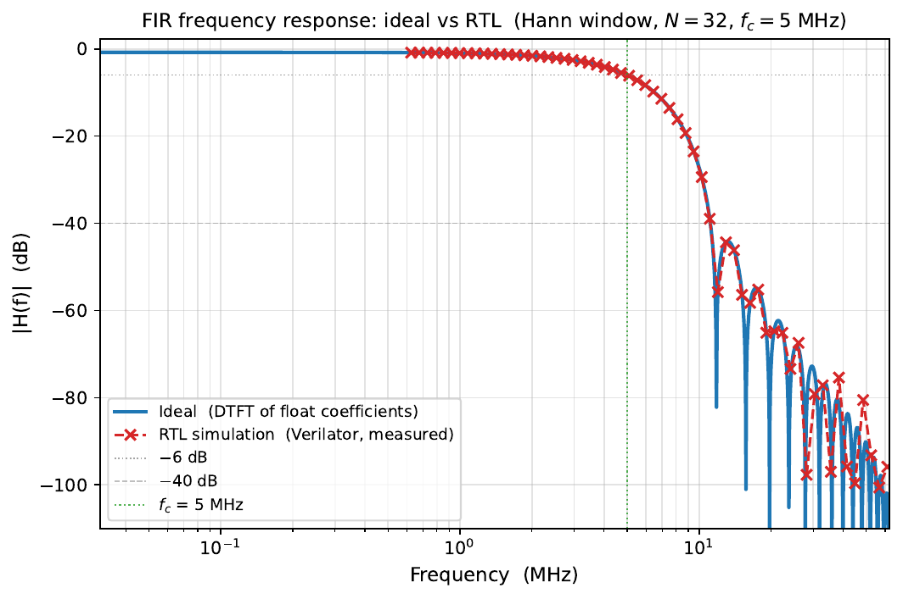

# Pound-Drever-Hall Laser Locking System

A hardware/software co-design implementation of a **Pound-Drever-Hall (PDH) laser frequency locking system** on a Red Pitaya STEMlab 125-14 (Xilinx Zynq XC7Z010 SoC). Real-time signal processing runs on the FPGA (PL), a TCP control server runs on the ARM cores (PS), and a Python client API provides remote operation from a host machine.

---

## Table of Contents

1. [Repository Structure](#repository-structure)
2. [Build and Deploy](#build-and-deploy)
3. [Controller GUI](#controller-gui)
4. [System Architecture](#system-architecture)
5. [Command Dispatch and Receive Architecture](#command-dispatch-and-receive-architecture)
6. [NCO Design](#nco-design)
7. [PID Controller Design](#pid-controller-design)
8. [FIR Filter Design](#fir-filter-design)
9. [IQ Demodulator Design](#iq-demodulator-design)
10. [DMA Live Capture Design](#dma-live-capture-design)
11. [Signal Representation and Fixed-Point Conventions](#signal-representation-and-fixed-point-conventions)
12. [IO Routing](#io-routing)
13. [Notable Design Choices](#notable-design-choices)
14. [Python Analysis Functions](#python-analysis-functions)

---

## Repository Structure

```
core/
  hw/
    prj/pdh_core/
      rtl/               FPGA RTL (SystemVerilog)
        pdh_top.sv       Board-level wrapper: clocking, PS instantiation, HP0 AXI tie-offs
        pdh_core.sv      Main control module: command decoder, IQ rotation, IQ demod, DMA orchestrator
        nco.sv           Numerically controlled oscillator (dual-output, quarter-ROM)
        iq_demod.sv      Instantaneous-product demodulator (configurable ref × input, Q15)
        pid_core.sv      Discrete PID with EMA derivative, anti-windup, decimation
        bram_controller.sv  Dual-clock BRAM capture buffer (pdh_clk write / fclk0 read)
        dma_controller.sv   AXI4 master for HP0 DDR burst writes
        sine_qtr_rom.sv  4096-entry, 16-bit quarter-sine ROM
        posedge_detector.sv  Rising-edge detector utility
      tb/                Testbenches (SystemVerilog, Icarus)
  sim/                   All RTL simulations (cocotb)
    run_regression.py      Runner for the command-echo regression test
    run_bode.py            Open-loop Bode analysis simulation
    run_fir_freq.py        FIR frequency-response verification simulation
    utils/
      test_pdh_core.py     cocotb test module — command-echo checks for every RTL register
      test_bode.py         cocotb test module — open-loop Bode measurement
      test_fir_freq_response.py  cocotb test module — FIR frequency response vs ideal
    Makefile.cocotb        cocotb regression make rules
    Makefile.bode          Bode sim make rules
    Makefile.fir_freq      FIR freq-response make rules
    artifacts/             Auto-indexed simulation output (JSON, CSV, PNG)
  sw/
    server.c             TCP server: two-thread interrupt-driven architecture (command thread + callback thread)
    control/
      control.c          Command handler implementations (cmd_*_send / cmd_*_cb split functions)
      hw_common.c        Hardware abstraction: mmap of AXI GP0 and HP0 DMA region; UIO interrupt primitives
      inc/
        server.h         cmd_ctx_t, cmd_entry_t, output_item_t definitions
        hw_common.h      pdh_cmd_t, pdh_callback_t, dma_frame_t packed unions; all enums
        control.h        Command handler declarations
  dts/
    pdh_irq.dts          Device Tree overlay — binds /dev/uio/pdh_uio to IRQ_F2P[1] (GIC SPI 62)
client/
  gui.py                 Interactive tkinter GUI — full hardware control without scripting
  pdh_api/
    api.py               Python API functions wrapping each TCP command
    types.py             Enums and result dataclasses mirroring the C/RTL types
    fir_design.py        Windowed-sinc FIR lowpass design (shared by GUI and sim tooling)
  test.py                Board-level regression test and visualization script
sim/
  pdh.m                  MATLAB PDH signal simulation
  power_terms.m          MATLAB power series analysis
pcb/                     PCB design files
```

---

## Build and Deploy

### RTL (FPGA Bitstream)

```bash
cd core/hw
make pdh_core       # Runs Vivado in batch mode; output: build/boot.bin
make clean
```

Requires Vivado and `bootgen` in PATH.

### Software (C Server)

```bash
cd core/sw
make server         # Cross-compiles for ARM; statically linked (-static -lm -lstdc++ -lpthread)
make clean
```

### Deploy (manual — raw SSH/SCP)

`deploy.sh` is not used. All deployment is done with plain `ssh`/`scp`.  Target: `root@10.42.0.62` (password: `root`).

#### 1. Flash the bitstream

```bash
# Copy bitstream to RP
scp core/hw/build/boot.bin root@10.42.0.62:/root/boot.bin

# Program the FPGA (full path required — fpgautil may not be in PATH over SSH)
ssh root@10.42.0.62 '/boot/bin/fpgautil -b /root/boot.bin -o /lib/firmware/base.dtbo'
```

#### 2. Build and copy the server

```bash
cd core/sw && make server
# Remove old build, copy fresh one
ssh root@10.42.0.62 'rm -rf /root/sw'
scp -r core/sw root@10.42.0.62:/root/sw
```

#### 3. Load the DTS overlay (PL-to-PS interrupt)

The interrupt path requires a Device Tree overlay that binds `/dev/uio/pdh_uio` to GIC SPI 62 (`IRQ_F2P[1]`).

```bash
# Compile the overlay on the host
dtc -I dts -O dtb -o core/dts/pdh_irq.dtbo core/dts/pdh_irq.dts

# Copy to RP
scp core/dts/pdh_irq.dtbo root@10.42.0.62:/root/pdh_irq.dtbo

# On the RP: remove any stale overlay, then load the new one
ssh root@10.42.0.62 '
    rmdir /sys/kernel/config/device-tree/overlays/pdh_irq 2>/dev/null || true
    mkdir -p /sys/kernel/config/device-tree/overlays/pdh_irq
    cp /root/pdh_irq.dtbo /sys/kernel/config/device-tree/overlays/pdh_irq/dtbo
'
```

After loading, verify the UIO device appears:

```bash
ssh root@10.42.0.62 'ls /dev/uio/pdh_uio'
```

#### 4. Start the server

**The server must be started from `sw/build/`** — `cmd_get_frame` writes `dma_log.csv` relative to the working directory.

```bash
ssh root@10.42.0.62 'cd /root/sw/build && ./server &'
```

### RTL Simulation (cocotb)

All simulations live in `core/hw/sim/`. Each is driven by a Python runner script that invokes cocotb/Verilator (or Icarus) via make, writes artifacts to a numbered subdirectory of `sim/artifacts/`, and exits non-zero on any test failure.

Requires `cocotb`, and either Verilator or Icarus Verilog (`iverilog`).

#### Command-Echo Regression (`run_regression.py`)

Exercises every command that has an observable callback echo and checks that the FPGA register round-trips match what was sent. DMA/frame capture is out of scope — inputs are tied to benign static values.

Checks covered (98 in total):
- **Reset**: `led_o` and `rst_o` cleared
- **Set LED**: `led_o` pin value and callback echo
- **Config IO**: DAC1/DAC2 source select and PID input select echoes
- **Set DAC**: both DAC1 and DAC2 code echoes (with server-side negation)
- **Get ADC**: ADC_A and ADC_B raw code echoes
- **Set NCO**: stride, shift, inv, sub, enable echoes; frequency quantization check
- **Set Rotation**: cos θ and sin θ coefficient echoes (within ±0.01 of float, limited by 14-bit CB truncation)
- **Set PID**: kp, kd, ki, dec, sp, alpha, sat, en, gain, bias, egain — all 11 coefficients
- **Set FIR**: address, coefficient, input select, write-enable, chain-write-enable echoes
- **Check Signed**: ADC_A, ADC_B, I feed, Q feed, IO routing register reads
- **Interrupt**: `irq_o` fires within expected cycles after strobe for a non-`CMD_GET_FRAME` command
- **Config Demod**: ref_sel, in_sel, and alpha echo checks (including 2 alpha echo checks)
- **IQ Demod functional**: in-phase product (NCO1×NCO1 → DC mean > 5000 counts) and quadrature product (NCO1×NCO2 → mean ≈ 0, std > 100 counts) checks via `dma_data_o`; demod_lpf DC check in `CAPTURE_DEMOD` test
- **EMA LPF routing**: 3 checks in section 18 verifying `demod_lpf` as a routing source for FIR and PID inputs

```bash
cd core/hw/sim
python run_regression.py                   # Verilator (default)
python run_regression.py --sim icarus
```

#### Open-Loop Bode Analysis (`run_bode.py`)

Programs a complete PID + FIR configuration into the RTL and measures the open-loop frequency response by injecting a swept sine at the error input and recording the controller output. Produces a Bode plot (magnitude + phase) comparing the RTL against an ideal analytical model.

```bash
cd core/hw/sim
python run_bode.py                              # defaults: Kp=0.5, Ki=0.0, Kd=0.0
python run_bode.py --kp 0.8 --ki 0.1 --kd 0.0
python run_bode.py --alpha 3 --satwidth 28
python run_bode.py --delay 6.2                  # 6.2 ns DAC→ADC line delay
python run_bode.py --dec 1,10,100,1000          # sweep multiple decimation codes
python run_bode.py --no-sim                     # replot most recent result
python run_bode.py --csv path/to/fir_coeffs.csv --sim icarus
```

Key arguments:

| Flag | Default | Description |
|------|---------|-------------|
| `--kp/ki/kd` | 0.5/0.0/0.0 | PID gains |
| `--alpha` | 2 | EMA derivative exponent |
| `--satwidth` | 31 | Integrator saturation width |
| `--delay NS` | 2500.0 | Physical DAC→ADC round-trip delay (ns) |
| `--dec` | 1,2,5,…,1000 | Comma-separated decimation codes to test |
| `--plot-dec` | median | Which decimation to display in Bode panels |
| `--csv PATH` | `test_resources/fir_coeffs_example.csv` | FIR coefficient CSV |
| `--no-sim` | — | Skip simulation; replot existing JSON |

Artifacts written to `sim/artifacts/bode/bode_N/`: `bode_results.json`, `bode_plot.png`.

#### FIR Frequency-Response Verification (`run_fir_freq.py`)

Designs a windowed-sinc lowpass filter, writes coefficients to a CSV, loads them into the RTL via cocotb, sweeps a sine through it, and overlays the measured RTL response against the ideal `sinc × window` response.

```bash
cd core/hw/sim
python run_fir_freq.py                              # 32 taps, 5 MHz corner, Hann
python run_fir_freq.py --ntaps 64 --corner 2e6
python run_fir_freq.py --corner 10e6 --window hamming
python run_fir_freq.py --no-sim                     # replot most recent result
```

Artifacts written to `sim/artifacts/fir_freq/fir_freq_N/`: `fir_coeffs.csv`, `fir_freq_results.json`, `fir_rtl_response.csv`, `fir_freq_response.png`.

### Python Client

```bash
cd client
python test.py      # Runs the board-level regression test
```

Requires: `paramiko`, `numpy`, `matplotlib`, `tk` (system package — see [Controller GUI](#controller-gui)).

---

## Controller GUI

`client/gui.py` is a `tkinter`-based GUI that exposes every API-reachable hardware state interactively, without writing or editing scripts.

### Prerequisites

In addition to the standard Python client requirements (`paramiko`, `numpy`, `matplotlib`), the system `tk` package is needed:

```bash
# Arch
sudo pacman -S tk

# Debian / Ubuntu
sudo apt install python3-tk
```

### Launching

```bash
cd client
python gui.py
```

The **IP** and **Port** fields at the top of the window default to `10.42.0.62` / `5555`. Change them before issuing any command to retarget a different device; the fields are read on every button press.

### Layout

```
Col 0: System, IO Routing, Sweep Ramp
Col 1: NCO, Rotation, IQ Demod, FIR
Col 2: PID, Frame Capture
```

### Tabs

#### System

| Control | Function |
|---------|----------|
| **Reset FPGA** | Calls `reset_fpga` after a confirmation dialog. Clears all FPGA state. |
| **Read ADC** | Reads IN1 and IN2 voltages and displays them in real time. |
| **DAC1 / DAC2** | Sets the DAC register value (float in [−1, 1]). Only takes effect when the DAC source is set to **Register** in the IO Routing tab. |
| **LED** | Sets the 8-bit LED pattern (decimal or `0x` hex). |

#### IO Routing

Three groups of radio buttons configure the signal routing:

- **DAC1 Source** / **DAC2 Source**: `Register` (manual value), `PID` (PID output), `NCO 1`, `NCO 2`.
- **PID Input**: `I Feed`, `Q Feed`, `ADC A`, `ADC B`, `FIR Out`, `IQ Demod Out`, `IQ Demod LPF`.

Click **Apply** to write all three selections in one `config_io` command. The feedback line beneath the button shows the values echoed back by the FPGA.

#### NCO

Configures the numerically controlled oscillator used for IQ demodulation and as a DAC drive signal.

| Field | Range | Notes |
|-------|-------|-------|
| Frequency (Hz) | (0, 62.5 MHz] | Snapped to the nearest stride count. Feedback shows the registered frequency and error. |
| Phase shift (°) | [−180, 180] | Relative phase offset between NCO output 1 and output 2. |
| Enable | checkbox | Enables/disables NCO output. |

The feedback line shows the registered frequency, frequency quantization error, phase shift, and shift error.

#### Rotation

Sets the IQ demodulation rotation angle. Use this to align the PDH error signal onto the I channel after accounting for any optical/electrical phase shift.

| Field | Range |
|-------|-------|
| Angle (°) | [−180, 180] (entry or slider) |

Feedback shows the applied cos θ, sin θ, and the resulting I/Q feed values.

#### IQ Demod

Configures the instantaneous-product demodulator. The demodulator multiplies a reference signal by an input signal, producing a baseband output that can be routed to the FIR filter or PID controller.

| Control | Options | Notes |
|---------|---------|-------|
| **Reference** | NCO 1, NCO 2 | Selects the reference (local oscillator) signal. |
| **Input** | NCO 1, NCO 2, ADC A, ADC B, I Feed, Q Feed, FIR Out | Selects the signal to demodulate. |
| **Alpha** | 0–15 | EMA LPF time constant exponent (default 8; larger = more smoothing). Controls the `demod_lpf` output. |

Click **Apply** to write all three selections. The feedback line shows the echoed values (e.g. `ref=NCO1 in=I_FEED alpha=8`).

#### FIR

Designs and programs a windowed-sinc lowpass filter into the FPGA FIR block.

**FIR Input** selects which signal is fed into the filter: `ADC 1`, `ADC 2`, `I Feed`, `Q Feed`, `IQ Demod Out`, or `IQ Demod LPF`.

**Filter Design** fields:

| Field | Default | Notes |
|-------|---------|-------|
| NTAPS | 32 (fixed) | Set at compile time to match the FPGA bitstream. |
| Corner freq (Hz) | 5 000 000 | Half-amplitude (−6 dB) cutoff. Must be in (0, 62.5 MHz). |
| Window | Hann | `Hann`, `Hamming`, `Blackman`, or `Rectangular`. Wider windows give better stopband attenuation at the cost of a wider transition band. |

Click **Apply** to design the filter and program the FPGA in one step. If any coefficient exceeds the Q15 range (magnitude ≥ 1), an error is shown without making the API call — reduce the corner frequency or choose a different window. The feedback line shows the DC gain and the maximum coefficient magnitude.

#### PID

Configures all PID controller parameters.

| Field | Default | Range | Notes |
|-------|---------|-------|-------|
| Kp | 0.5 | [−1, 1) | Proportional gain (Q15) |
| Ki | 0.0 | [−1, 1) | Integral gain (Q15) |
| Kd | 0.0 | [−1, 1) | Derivative gain (Q15) |
| Setpoint | 0.0 | [−1, 1) | Error signal zero target (Q13, in volts) |
| Decimation | 100 | [1, 16383] | PID update interval in clock cycles (125 MHz) |
| Alpha | 4 | [0, 15] | EMA derivative filter time constant (larger = more smoothing) |
| Satwidth | 31 | [15, 31] | Integrator saturation bound (±2^satwidth) and I-term shift |
| Enable | ☐ | — | Enables/disables the PID output |

Click **Apply** to write all parameters. The feedback line shows every coefficient echoed back by the FPGA.

#### Frame Capture

Triggers a DMA snapshot and plots the result in a new matplotlib window.

| Field | Default | Notes |
|-------|---------|-------|
| Frame code | `ADC_DATA_IN` | Selects which signals are packed into each 64-bit DMA word (see [Frame Types](#frame-types)). |
| Decimation | 1 | Sample rate divisor (1 = full 125 MHz rate; N = every Nth sample). |

Click **Capture Frame** to start a capture. The button disables while the DMA transfer and SFTP retrieval complete (typically 0.5–2 s). On success, a new matplotlib window opens with one subplot per signal column; each click creates an additional independent window. The status bar at the bottom of the GUI shows the sample count and frame code on success, or the error message in red on failure.

#### Sweep Ramp

Steps a selected DAC from V0 to V1 and reads signals at every step.

| Field | Default | Notes |
|-------|---------|-------|
| DAC | DAC 1 | Target DAC for the voltage ramp. |
| V0 | −1.0 | Start voltage in [−1.0, 1.0] V. |
| V1 | 1.0 | End voltage in [−1.0, 1.0] V (not included). |
| Points | 100 | Number of steps [2, 16384]. |
| Delay µs | 0 | Per-step settling delay in microseconds. |
| Demod mode | 0 | `0` (default): reads ADC A, ADC B, I Feed, Q Feed via `CMD_CHECK_SIGNED`. `1`: captures `dac_v` and `demod_lpf` only — for use with internal IQ demodulation. |
| Plot checkboxes | all on | Select which of the available signals to plot. |

Click **Run Sweep** to execute. The CSV (`sweep_log.csv`) is fetched from the RP and plotted as one subplot per selected signal versus DAC voltage, with a shared x-axis. Each click creates an independent window.

### Status Bar

The status bar at the bottom of the window shows the result of the most recent command:

- **Green text**: command succeeded; shows key feedback values.
- **Red text**: command failed; shows the full error message.

The status bar clears automatically after 10 seconds.

---

## System Architecture

```
Host PC (Python)
    |
    | TCP port 5555 (text protocol)
    v
ARM Cortex-A9 (Linux)  [two pthreads]
    Thread 1 (command)   ── accept(), parse, cmd_*_send(), push pending queue
    Thread 2 (callback)  ── blocks on /dev/uio/pdh_uio read(); on interrupt:
                              reads GP0 callback, runs cmd_*_cb(), sends TCP response
    hw_common.c          ── mmap of AXI GP0 (commands+callbacks) and HP0 DDR region
    |
    | AXI GP0 (0x42000000)  32-bit command/callback
    | AXI HP0 (0x10000000)  64-bit DMA write port
    | IRQ_F2P[1] / GIC SPI 62  EDGE_RISING interrupt → /dev/uio/pdh_uio
    |
    v
FPGA (Zynq PL, 125 MHz)
    pdh_core.sv  ── command decoder, IQ rotation, IO mux, DMA orchestrator
    nco.sv       ── LO generation for IQ demodulation
    pid_core.sv  ── PID feedback controller
    bram_controller.sv  ── sample capture buffer
    dma_controller.sv   ── AXI4 master → HP0 DDR
```

### Clock Domains

| Domain    | Source                                     | Frequency  | Used for                          |
|-----------|--------------------------------------------|------------|-----------------------------------|
| `pdh_clk` | ADC differential clock (IBUFGDS + BUFG)    | 125 MHz    | All FPGA signal processing        |
| `fclk0`   | PS fabric clock (exported by block design) | configurable | DMA controller, BRAM read port  |

The ADC clock is also routed out as `dac_clk_o` to clock the DAC.

---

## Command Dispatch and Receive Architecture

This is a layered architecture: text protocol → C dispatch table → AXI packed-union commands → FPGA register → callback readback.

### TCP Text Protocol

Every command from the Python client is a single TCP transaction (connect, send, receive, close):

```
CMD:<command_name>\n
F:<f0>,<f1>,...\n     (optional float arguments)
I:<i0>,<i1>,...\n     (optional signed integer arguments)
U:<u0>,<u1>,...\n     (optional unsigned integer arguments)
```

The server responds with:

```
type:output\n
name:<command_name>\n
status:<integer_code>\n
<KEY>:<value>\n
...
```

All values are plain ASCII. The Python client's `_parse_response()` coerces each value to `int` or `float` automatically.

### Server Dispatch Table

`server.c` maintains a static table of 14 entries. Each entry carries a `send_func` / `cb_func` pair for interrupt-driven commands, or a `mono_func` for commands that complete synchronously in Thread 1.

| Command | Mode | floats | ints | uints |
|---------|------|--------|------|-------|
| `set_led` | split (send+cb) | 0 | 0 | 1 |
| `reset_fpga` | mono | 0 | 0 | 0 |
| `set_dac` | split (send+cb) | 1 | 0 | 1 |
| `get_adc` | split (send+cb) | 0 | 0 | 0 |
| `check_signed` | split (send+cb) | 0 | 0 | 1 |
| `set_rotation` | mono | 1 | 0 | 0 |
| `get_frame` | split (send+cb) | 0 | 0 | 2 |
| `test_frame` | mono | 0 | 0 | 1 |
| `set_pid` | mono | 4 | 0 | 4 |
| `set_fir` | mono | 0 | 0 | 1 |
| `set_nco` | mono | 2 | 0 | 1 |
| `config_io` | split (send+cb) | 0 | 0 | 3 |
| `config_demod` | split (send+cb) | 0 | 0 | 2 |
| `sweep_ramp` | mono | 2 | 0 | 3 |

**Split commands** (`send_func` + `cb_func`): Thread 1 calls `_send`, writes the strobe, then pushes the pending context to `g_pending`. Thread 2 blocks on `uio_wait_irq()` and calls `_cb` after the FPGA interrupt fires.

**Monolithic commands** (`mono_func`): Thread 1 executes the entire handler synchronously (no interrupt involved) and sends the TCP response immediately. These are either multi-sub-command sequences (`set_pid` issues 11 sequential strobes; `set_nco` issues 5; `set_rotation` commits cos/sin atomically; `set_fir` loads all 32 taps then commits) or commands that have no FPGA callback (`reset_fpga`, `test_frame`).

Dispatch performs a linear name search; argument-count mismatches return an error before the handler is called. The handler receives a `cmd_ctx_t` with parsed arguments and writes its result into `ctx->output`.

### AXI GP0 Command Register

The ARM accesses the FPGA through a 32-bit AXI GPIO peripheral mapped at physical address `0x42000000`. Write offset `+8` drives the FPGA input register; read offset `+0` reads the FPGA callback register.

The 32-bit command word (`pdh_cmd_t`) is a packed union with this layout:

```
Bit 31   : rst     (async reset, bypasses strobe mechanism)
Bit 30   : strobe  (rising edge triggers command latching in FPGA)
Bits 29:26: cmd    (4-bit command opcode)
Bits 25:0 : data   (26-bit command payload)
```

### Strobe Protocol

Every FPGA command is written twice:

```c
static inline pdh_callback_t pdh_execute_cmd(pdh_cmd_t cmd)
{
    cmd.strobe.val = 0;
    pdh_send_cmd(cmd);      // write with strobe=0
    cmd.strobe.val = 1;
    pdh_send_cmd(cmd);      // write with strobe=1 → triggers FPGA action
    pdh_callback_t cb = { 0 };
    pdh_get_callback(&cb);  // read callback register
    return cb;
}
```

The first write establishes the payload with a known strobe level, preventing spurious edges. The second write asserts the strobe. `pdh_send_cmd` writes to the mmap'd register with a `__sync_synchronize()` memory barrier to ensure the store completes before proceeding.

### FPGA Synchronization and Latching

The AXI bus is in the PS clock domain; `pdh_core` runs at `pdh_clk` (125 MHz). A 3-stage flip-flop chain synchronizes the AXI input:

```
axi_from_ps_i → axi_1ff_r → axi_2ff_r → axi_3ff_r  (all clocked on pdh_clk)
```

A `posedge_detector` on `axi_3ff_r[30]` (the strobe bit) produces a single-cycle pulse `strobe_edge_w`. On that pulse, the synchronized value is latched into `axi_from_ps_r`, which drives the command decoder:

```
next_axi_from_ps_w = strobe_edge_w ? axi_3ff_r : axi_from_ps_r;
```

The command opcode and data payload are then extracted:

```
cmd_w  = axi_from_ps_r[29:26]   // selects which register to update
data_w = axi_from_ps_r[25:0]    // payload value
```

Every register update is a purely combinational assign guarded by `cmd_w`. All guarded values are registered in the main `always_ff` block on the next rising edge of `pdh_clk`.

### Callback Register

The FPGA drives a separate 32-bit output register (`axi_to_ps_o`) whose value is determined combinationally by `cmd_w`. Each command has its own callback word format (defined in `pdh_callback_t`) that echoes back the just-written register values, encoded with the command opcode in bits `[31:28]`.

For example, the `CMD_SET_NCO` callback:

```
Bits 31:28 : cmd opcode (0b1001)
Bit  27    : (padding)
Bits 26:15 : nco_stride_r   (12 bits)
Bits 14:3  : nco_shift_r    (12 bits)
Bit  2     : nco_sub_r
Bit  1     : nco_inv_r
Bit  0     : nco_en_r
```

### Callback Validation

`validate_cb()` in `control.c` compares each echoed field to the intended value and returns a non-zero error code on mismatch:

```c
static inline int validate_cb(void* cb, void* expected, int tag,
    const char* func, const char* name, int success_code, int fail_code);
```

Because the callback reflects the FPGA's registered state immediately after the strobe, a mismatch indicates either a write failure or an AXI contention issue.

### PID Coefficient Multiplexing

The PID has 11 independent coefficients (kp, kd, ki, dec, sp, alpha, sat, en, gain, bias, egain). Because the command word has only 26 payload bits, each coefficient is written in a separate transaction. The 4-bit `coeff_sel` field in bits `[19:16]` of the data word selects which coefficient register is updated. The corresponding callback echoes the selected coefficient's current value. `cmd_set_pid` in `control.c` issues 11 sequential `pdh_execute_cmd` calls, one per coefficient.

The NCO uses the same multiplexing scheme with a 3-bit `coeff_sel` for five parameters: stride, shift, invert, sub, enable.

---

## NCO Design

The numerically controlled oscillator generates two phase-coherent sinusoidal outputs for use as local oscillators in IQ demodulation and as DAC drive signals.

### Phase Accumulator

A 14-bit accumulator `phi1_r` increments by `stride_r` on every clock cycle when the NCO is enabled:

```
phi1_r[k+1] = phi1_r[k] + stride_r
```

The accumulator wraps naturally at 2^14 = 16384, representing one full cycle. The output frequency is:

```
f_out = stride × (125 MHz / 16384) = stride × 7629.394... Hz
```

This constant (`STRIDE_CONST = 125e6 / (4 × 4096) = 7629.394 Hz/stride`) is used in `cmd_set_nco` to convert from Hz to stride counts. Valid stride range is 1–1024, giving an output frequency range of approximately **7.6 kHz to 7.8 MHz**.

### Second Output and Phase Offset

The second phase accumulator `phi2_w` is derived from the primary accumulator with an optional phase offset:

```
phi2_w = phi1_r + shift_r    (sub=0, default)
phi2_w = phi1_r - shift_r    (sub=1)
```

`shift_r` is a 12-bit value representing a phase angle within one quadrant (0 to π/2). The full phase offset in degrees is encoded with `sub` and `invert` flags (see the phase-offset encoding in `cmd_set_nco`).

### Quarter-Sine ROM and Quadrant Folding

Rather than storing a full 16384-entry sine table, only the first quadrant (4096 entries, 16-bit signed output) is stored in `sine_qtr_rom`. Quadrant folding reconstructs the full sine wave:

```
phi[13:12] determines the quadrant (Q1=00, Q2=01, Q3=10, Q4=11)

ROM address:
  Q1, Q3 (ascending):   addr = phi[11:0]
  Q2, Q4 (descending):  addr = 4095 - phi[11:0]

Sign:
  Q1, Q2 (positive half): output = +ROM[addr]
  Q3, Q4 (negative half): output = -ROM[addr]
```

This reduces ROM footprint to 1/4 of a full-cycle table with no loss of precision. The `invert` flag additionally negates `out2_o`, allowing the second output to be inverted with respect to its base phase-shifted waveform.

### Pipeline Latency

The ROM has one registered read stage, giving a total pipeline depth of three clock cycles from `phi1_r` update to valid `out1_o`/`out2_o`:

```
Cycle 0: phi1_r updated, phi2_w computed
Cycle 1: phi1_pipe1_r, phi2_pipe1_r registered; addr1_r, addr2_r computed and registered
Cycle 2: ROM outputs registered (rom1_lookup_w read)
Cycle 3: rom1_signed_r, rom2_signed_r registered → out1_o, out2_o valid
```

### DAC Output Conversion

The NCO outputs are 16-bit signed values in Q15 format (range ±32767). The Red Pitaya DAC expects 14-bit unsigned offset-binary (0 = −1 V, 8191 = 0 V, 16383 = +1 V). The conversion function `s16_to_u14` performs:

```sv
function automatic logic [13:0] s16_to_u14(input logic signed [15:0] in);
    logic signed [15:0] t1 = -(in >> 2) + 16'sd8191;
    s16_to_u14 = t1[13:0];
endfunction
```

The arithmetic shift right by 2 scales from the Q15 range (±32767) to the DAC's 14-bit range (±8191), the negation corrects for the DAC's inverted output polarity, and the +8191 offset centers the waveform at 0 V.

---

## PID Controller Design

The PID controller (`pid_core.sv`) is a fully discrete-time, fixed-point implementation with configurable decimation, EMA derivative filtering, anti-windup integration, and output saturation.

### Inputs and Error Signal

```
error_w = dat_i − sp_r
```

- `dat_i`: 16-bit signed process variable (from IQ demodulation or raw ADC, per IO routing)
- `sp_r`: 14-bit signed setpoint in Q13 format (range [−8192, +8191], divide by 8192 to get volts)

Both are in the same numerical scale: the ADC conversion `adc_16s = −(adc_raw − 8192)` produces values in [−8192, +8192], which is identical to the Q13 setpoint scale. At steady state, `dat_i == sp_r` exactly (modulo quantization), which means the setpoint value in volts equals the measured voltage.

### Decimation

The PID update rate is divided down from the 125 MHz clock by `decimate_r`:

```
tick1_w = enable_i && (cnt_r == 0)
cnt_r[k+1] = (cnt_r >= decimate_r − 1) ? 0 : cnt_r + 1
```

P, D, and I terms are only recomputed when `tick2_r` is high (one cycle after `tick1_r`). This reduces effective bandwidth and allows the controller to operate at rates suitable for slower physical systems without changing the FPGA clock.

### Proportional Term

```
p_error_w = kp_r × error_pipe1_r      (32-bit product)
p_error_shifted_w = p_error_r >>> 15  (Q15 normalization)
```

`error_pipe1_r` is `error_w` delayed by one tick to pipeline the multiply. `kp_r` is Q15 signed (range [−1, +1), stored as a 16-bit integer; divide by 32768 to recover the float value).

### Derivative Term with EMA Filter

Raw finite-difference differentiation is noise-sensitive. The derivative is instead computed as the difference between the raw error and an exponential moving average (EMA) of the error, which acts as a low-pass filter:

```
yk_w = ((error_w − yk_r) >>> alpha_r) + yk_r
     = 2^(−alpha) × error_w + (1 − 2^(−alpha)) × yk_r
```

This is the standard first-order IIR (EMA) update. The derivative signal is:

```
d_error_w = kd_r × (error_w − yk_r)   (the high-frequency error component)
d_error_shifted_w = d_error_r >>> 15
```

`alpha_r` controls the EMA time constant: larger `alpha` → longer memory → more smoothing → lower derivative cutoff frequency. Valid range: 0–15.

### Integral Term with Anti-Windup

The integrator accumulates the error each tick:

```
sum_error_wide_w = sum_error_r + error_w     (33-bit to detect overflow)
sum_error1_w = apply_satwidth_truncation(sum_error_wide_w, 2^satwidth_r)
```

`satwidth_r` (range 15–31) bounds the integrator state to ±2^satwidth, preventing excessive windup.

Anti-windup is implemented by freezing the integrator when the output is already saturated and the new error would further increase the accumulator in the same direction:

```c
sum_error2_w = (tick1_r
    && !(pid_out == 0x3FFF && sum_error1_w > sum_error_r)   // saturated high
    && !(pid_out == 0      && sum_error1_w < sum_error_r))  // saturated low
    ? sum_error1_w : sum_error_r;
```

The integral output is:

```
i_error_w = ki_r × sum_error_r
i_error_shifted_w = i_error_r >>> satwidth_r
```

Using `satwidth_r` for both the integrator bound and the I-term right-shift links the two: a tighter saturation also scales down the I-term contribution, keeping gains consistent across different saturation settings.

### Output Mapping

The three terms are summed and mapped to the 14-bit unsigned DAC format:

```
total_error_wide_w = p_error_shifted_w + d_error_shifted_w + i_error_shifted_w
pid_out = sat_unsigned_from_signed(total_error_wide_w + 8191)
```

`sat_unsigned_from_signed` maps the signed 20-bit sum to [0, 16383]:

- Negative input → 0 (minimum DAC, −1 V)
- Input > 16383 → 16383 (maximum DAC, +1 V)
- Otherwise → lower 14 bits

Adding 8191 before the conversion centers the zero-error output at mid-scale (0 V at DAC output), so the controller is unbiased when the error is zero.

### Coefficient Encoding Summary

| Parameter | Format | Range        | Encoding                        |
|-----------|--------|--------------|---------------------------------|
| kp, kd, ki | Q15  | [−1, +1)     | int16 / 32768.0                 |
| sp        | Q13    | [−1, +1)     | int14 / 8192.0                  |
| dec       | uint14 | [1, 16383]   | clock cycles per PID update     |
| alpha     | uint4  | [0, 15]      | EMA time constant exponent      |
| sat       | uint5  | [15, 31]     | integrator bound and I-shift    |
| gain      | Q10    | [−32, +32)   | output gain multiplier; int16 / 1024.0  |
| bias      | Q13    | [−1, +1)     | DC offset added to output; int14 / 8192.0 |
| egain     | Q10    | [−32, +32)   | input (error) gain multiplier; int16 / 1024.0 |

---

## FIR Filter Design

A programmable FIR lowpass filter sits between the IQ demodulation stage and the PID controller. It is implemented across two RTL modules (`fir.sv` / `fir_tap.sv`) and designed in software via `client/pdh_api/fir_design.py`.

### Signal Placement

```
ADC A/B          ──┐
I Feed           ──┤
Q Feed           ──┼─► [FIR input mux] ──► fir.sv ──► FIR Out ──► [PID input mux] ──► pid_core
IQ Demod Out     ──┤
IQ Demod LPF Out ──┘
```

The FIR input source and whether the PID consumes the FIR output are both controlled independently via `config_io`. The filter can be programmed and its input/output routed at any time without affecting other subsystems.

### Architecture

#### Tap Structure (`fir_tap.sv`)

Each tap computes a saturating Q15 multiply-accumulate:

```
coeff_r (DW-bit Q15) × din_i (DW-bit Q15)  →  prod_wide (2×DW bits, Q30)
prod_wide[2×DW−1 : DW−1]  →  saturate_product  →  dout_o (DW-bit Q15)
```

The product uses the upper `DW+1` bits of the full `2×DW`-bit result (i.e. bits `[31:15]` for DW=16). The `saturate_product` function checks the top two bits for overflow and clamps to `[MIN, MAX]` if they disagree, otherwise takes the lower `DW` bits. This is a standard Q15 multiply: the product of two Q15 numbers is Q30; discarding the bottom 15 fractional bits and keeping the top 16 gives a Q15 result.

Each tap also pipelines `din_i` through `din_pipe1_o`, forming a shift-register chain across all NTAPS instantiations:

```
din_i → tap[0].din_pipe1_o → tap[1].din_pipe1_o → … → tap[NTAPS−1].din_pipe1_o
```

#### Adder Tree (`fir.sv`)

The NTAPS tap outputs are summed in a registered binary adder tree with `AW = ⌈log₂(NTAPS)⌉` pipeline stages:

```
Stage 0: tap_out_bus[0..NTAPS−1]  (unregistered, wire assignment)
Stage 1: NTAPS/2 registered sums of adjacent pairs
Stage 2: NTAPS/4 registered sums
…
Stage AW: 1 registered final sum  →  dout_o
```

Each adder uses the same `sat_add` saturating function: both operands are sign-extended to `DW+1` bits, added, and the result is clamped if the sign bit and the MSB of the `DW`-bit result disagree. This prevents any single large coefficient from overflowing the output even in the worst-case all-in-phase input scenario.

**NTAPS must be a power of 2** so the binary tree is complete and all intermediate stage widths are exact powers of two.

#### Pipeline Latency

Total latency from `din_i` to `dout_o`:

```
1 cycle  (tap register: din_i → din_pipe1_r, coeff × din_i → out_r)
+ AW cycles  (adder tree pipeline stages)
= 1 + AW cycles
```

For the default configuration (NTAPS=32, AW=5): **6 clock cycles** at 125 MHz = 48 ns.

### Coefficient Loading

Updating coefficients is a two-phase atomic operation, preventing the filter from running with a partially written coefficient set:

1. **Write phase**: coefficients are written one at a time into `tap_coeffs[addr]`, a shared staging array in `fir.sv`, via `tap_addr_i` / `tap_coeff_i` / `tap_mem_write_en_i`.
2. **Commit phase**: a single pulse on `tap_chain_write_en_i` simultaneously latches every `tap_coeffs[i]` into the corresponding `coeff_r` register inside each `fir_tap`. The filter begins using the new coefficients on the very next clock cycle.

This guarantees that the filter is never in an inconsistent state mid-update. `cmd_set_fir` in `control.c` issues `NTAPS` sequential write-address commands followed by one chain-write-enable command.

Coefficients are Q15 16-bit signed values. The valid range is `[−32768, +32767]`, i.e. `[−1, +1)` in float. Writing coefficients outside this range or with total energy exceeding the single-precision accumulation capacity will cause saturation in the adder tree.

### Coefficient Design

`client/pdh_api/fir_design.py` implements a windowed-sinc lowpass design:

```
h[n] = sinc(ωc × (n − nc) / π)  ×  w[n]
```

where `ωc = 2π × f_corner / fs` is the normalized cutoff and `nc = (NTAPS − 1) / 2` is the centre tap. The window `w[n]` trades passband ripple against stopband attenuation:

| Window | Passband ripple | Stopband attenuation | Transition width |
|--------|----------------|----------------------|-----------------|
| Rectangular | ±0.9 dB | ~21 dB | Narrowest |
| Hann | ±0.06 dB | ~44 dB | Moderate |
| Hamming | ±0.02 dB | ~41 dB | Moderate |
| Blackman | ±0.002 dB | ~74 dB | Widest |

`design_lowpass` raises `ValueError` if `max|coeff| ≥ 1.0` — the Q15 range would be exceeded. This happens at very high corner frequencies (approaching `fs/2`) where the ideal sinc kernel values approach 1. The fix is to lower the corner frequency or choose a windowed design; for standard PDH demodulation bandwidths (< 10 MHz) it does not arise.

`f_corner` is the half-amplitude (−6 dB) point of the ideal sinc kernel, not the −3 dB point. The actual −3 dB frequency shifts with window choice.

### Frequency-Response Simulation

`core/hw/sim/run_fir_freq.py` designs a filter, writes the coefficients to a CSV, runs the cocotb/Verilator RTL simulation, and overlays the ideal frequency response against the measured RTL response:

```bash
cd core/hw/sim
python run_fir_freq.py                              # 32 taps, 5 MHz corner, Hann
python run_fir_freq.py --ntaps 64 --corner 2e6
python run_fir_freq.py --corner 10e6 --window hamming
python run_fir_freq.py --no-sim                     # replot most recent result
```

Artifacts (coefficient CSV, results JSON, response PNG) are written to `sim/artifacts/fir_freq/fir_freq_N/` with an auto-incrementing index so successive runs never overwrite each other.



*Ideal DTFT response overlaid with the RTL-measured response (32-tap Hann, 5 MHz corner), confirming negligible deviation from quantization and pipeline rounding across the passband.*

---

## IQ Demodulator Design

The `iq_demod` module implements a single-cycle registered instantaneous-product demodulator. It multiplies a configurable reference signal by a configurable input signal to produce a Q15 baseband output — the core operation of lock-in detection and PDH frequency discrimination.

### Operation

```
out[n] = (ref[n] × in[n]) >> 15
```

Both `ref` and `in` are 16-bit Q15 signed values. Their 32-bit product is an arithmetic right-shifted by 15 to renormalize back to Q15, matching the convention used by the rotation matrix. The shift is applied in a single registered pipeline stage (one clock cycle latency).

### EMA Low-Pass Filter on Demodulator Output

A continuously-running exponential moving average (EMA) low-pass filter is applied to the demodulator output at the full 125 MHz clock rate:

```
lpf[n] = lpf[n-1] + (demod_out[n] - lpf[n-1]) >> alpha
```

This is a first-order IIR filter. The `alpha` parameter (4-bit, range 0–15, default 8) controls the time constant:

| alpha | Time constant τ | −3 dB frequency |
|-------|----------------|-----------------|
| 8     | ≈ 2 µs         | ≈ 79 kHz        |
| 10    | ≈ 8 µs         | ≈ 19 kHz        |

Larger `alpha` gives a longer memory (more smoothing) and a lower cutoff frequency. The filter runs continuously regardless of whether any downstream consumer is active, so its output (`demod_lpf`) is always valid.

`alpha` is configured via `CMD_CONFIG_DEMOD` (see command description below). The filtered output `demod_lpf` is available as a routing source for both the FIR filter input and the PID error input, in addition to the unfiltered `demod_out`.

### Reference Source Selection

`demod_ref_sel_r` (1 bit) selects the reference (local oscillator) signal:

| Code | Name | Source |
|------|------|--------|
| 0    | NCO1 | `nco_out1_r` — in-phase NCO output |
| 1    | NCO2 | `nco_out2_r` — quadrature NCO output |

### Input Source Selection

`demod_in_sel_r` (3 bits) selects the signal to demodulate:

| Code | Name        | Source |
|------|-------------|--------|
| 0    | NCO1        | `nco_out1_r` |
| 1    | NCO2        | `nco_out2_r` |
| 2    | ADC_A       | `adc_dat_a_16s_r` (signed, centred) |
| 3    | ADC_B       | `adc_dat_b_16s_r` |
| 4    | I_FEED      | `i_feed_r` (rotation matrix I output) |
| 5    | Q_FEED      | `q_feed_r` (rotation matrix Q output) |
| 6    | FIR_OUT     | `fir_out_w` (FIR filter output) |

### Command: `config_demod` (opcode `0b1011`)

Source selects and the EMA LPF alpha are written in one `cmd_config_demod` command. Data word layout:

```
Bit  [0]    : ref_sel  (0 = NCO1, 1 = NCO2)
Bits [3:1]  : in_sel   (3-bit, 0–6)
Bits [7:4]  : alpha    (4-bit EMA exponent, default = 8)
```

The callback echoes the registered values:

```
Bits [31:28] : CMD_CONFIG_DEMOD (0b1011)
Bits [27:8]  : 0 (padding)
Bits [7:4]   : demod_alpha_r
Bits [3:1]   : demod_in_sel_r
Bit  [0]     : demod_ref_sel_r
```

### Downstream Routing

Both the raw demodulator output and the EMA-filtered output feed into the IO routing muxes:

- **FIR filter input**: set FIR input to `IQ_DEMOD_OUT` (code 4) or `IQ_DEMOD_LPF` (code 5) via `config_io`
- **PID controller input**: set PID input to `IQ_DEMOD_OUT` (code 5) or `IQ_DEMOD_LPF` (code 6) via `config_io`

FIR can be set to take the demodulator output while the demodulator is also set to take FIR output. This is safe because both paths are fully registered — there is no combinatorial loop.

### `CAPTURE_DEMOD` Frame

The `CAPTURE_DEMOD` frame type (code `0b1000`) packs all demodulator-relevant signals into a single 64-bit DMA word:

```
Bits [63:48] : demod_lpf_r (EMA low-pass filtered demodulator output)
Bits [47:32] : demod_out_w (instantaneous product output, Q15)
Bits [31:16] : demod_ref_w (muxed reference signal, before multiply)
Bits [15:0]  : demod_in_w  (muxed input signal, before multiply)
```

CSV columns: `demod_in`, `demod_ref`, `demod_out`, `demod_lpf`.

---

## DMA Live Capture Design

The DMA system provides a triggered snapshot of 16384 consecutive 64-bit samples from any combination of internal signals, transferred to DDR and read back by the ARM as a CSV file.

### Overview

The capture pipeline has three stages operating across two clock domains:

```
[pdh_clk] FPGA signals → bram_controller (dual-clock BRAM write)
                          ↓ (CDC: dual-port BRAM)
[fclk0]                dma_controller (AXI4 master → HP0 DDR at 0x10000000)
                          ↓ (memory barrier)
[ARM]                  mmap read → CSV write → SFTP to host
```

### Stage 1: BRAM Capture (`bram_controller.sv`)

A 16384×64-bit dual-clock BRAM (`dc_bram`) captures the FPGA data stream:

- **Write port**: `pdh_clk` domain. The `bram_controller` FSM has two states:
  - `ST_IDLE`: `bram_ready_o = 1`. On a rising edge of `enable_i` (synchronized via `posedge_detector`), the latched `decimation_code_i` is captured and the FSM transitions to `ST_CAPTURE_DATA`.
  - `ST_CAPTURE_DATA`: `bram_ready_o = 0`. A 22-bit counter divides the 125 MHz clock by `decimation_code_r`, writing one sample to BRAM per `decimation_code_r` clocks. The write address advances until `addr_r == 16383`, at which point the FSM returns to `ST_IDLE`.

- **Read port**: `fclk0` domain, driven by the `dma_controller`'s `bram_addr_o`.

The dual-clock BRAM provides inherent clock domain crossing between `pdh_clk` (write) and `fclk0` (read).

**Capture time** (at decimation = N): `N × 16384 / 125 MHz = N × 131 µs`

### Stage 2: AXI4 Burst Transfer (`dma_controller.sv`)

The DMA controller is a custom AXI4 master that sequences 16-beat INCR bursts from the BRAM to HP0 DDR:

| AXI Parameter  | Value                    |
|----------------|--------------------------|
| Burst type     | INCR (2'b01)             |
| Burst length   | 16 beats (AWLEN = 15)    |
| Beat size      | 8 bytes / 64 bits        |
| Write strobes  | 0xFF (all bytes valid)   |
| Base address   | 0x10000000               |
| Total size     | 0x20000 = 128 KB         |
| Total bursts   | 128 KB / 128 B = 1024    |

The FSM has four states:

1. **ST_IDLE**: resets address to base, asserts `dma_ready_o`. Transitions to `ST_SET_ADDR_AWAIT_ACK` on a rising edge of `enable_i` (3-stage synchronized from `pdh_clk`).
2. **ST_SET_ADDR_AWAIT_ACK**: drives `AWVALID` and holds the current burst address. Transitions to `ST_SET_DATA_AWAIT_ACK` when `AWREADY` is asserted.
3. **ST_SET_DATA_AWAIT_ACK**: drives `WVALID` and streams 16 beats, incrementing `beat_r` on each `WREADY`. Asserts `WLAST` on the final beat. Transitions to `ST_AWAIT_RESP` after the 16th beat is acknowledged.
4. **ST_AWAIT_RESP**: waits for `BVALID`. On a successful response (`BRESP == 2'b00`), increments the address by 128 bytes. If the final address is reached, returns to `ST_IDLE` (where `dma_ready_o` is reasserted); otherwise returns to `ST_SET_ADDR_AWAIT_ACK` for the next burst.

The BRAM read address is computed from the current burst address and beat counter:

```sv
bram_addr_o = ((addr_r - HP0_BASE_ADDR) >> 3) + beat_r
```

This sequentially reads BRAM locations 0–16383 as the DMA sweeps through DDR.

### Stage 3: DMA Orchestrator FSM (`pdh_core.sv`)

`pdh_core` coordinates BRAM capture and DMA transfer through a 4-state FSM in the `pdh_clk` domain:

```
DMA_ARMED ──[CMD_GET_FRAME received && bram_ready]──> DMA_RUN_BRAM
              (asserts bram_enable_o)
DMA_RUN_BRAM ──[bram capture done && dma_ready]──> DMA_RUN_AXI
               (asserts dma_enable_o)
DMA_RUN_AXI ──[dma_ready posedge (DMA complete)]──> DMA_STALE
DMA_STALE ──[CMD_GET_FRAME no longer active]──> DMA_ARMED
```

`dma_ready_i` (from `fclk0` domain) is synchronized through a 3-stage flip-flop chain (`dma_ready_1ff/2ff/3ff`) before being used in the `pdh_clk` domain. Edge detection on `dma_ready_3ff` generates the DMA-complete pulse.

The `bram_ready_i` signal (from `pdh_clk` domain `bram_controller`) is registered once and also edge-detected. The `bram_edge_acquired_r` flag ensures the transition to `DMA_RUN_AXI` waits for a bram-complete edge that occurred *after* the current capture started.

### Stage 4: Software Readback

After issuing `CMD_GET_FRAME`, the C server waits for the DMA to complete via a hardware interrupt rather than a timed sleep.

The FPGA asserts `irq_o` (a 1-cycle pulse) on the rising edge of `dma_ready_3ff` — the moment the DMA controller returns to idle after the final burst response.  In `pdh_top.sv`, this pulse is widened to 32 cycles (~256 ns) by a counter-based pulse stretcher, then synchronized into `fclk0` by a 3-stage flip-flop chain before being routed to `IRQ_F2P[1]` (GIC SPI 62, EDGE_RISING).

The interrupt path through the block design:

```
pdh_core irq_o  →  pulse stretcher (32×, pdh_clk)
                 →  3FF synchronizer (fclk0)
                 →  BD port irq_f2p[0]
                 →  xlconcat_irq In1
                 →  IRQ_F2P[1]  →  GIC SPI 62
```

On the software side, a dedicated callback thread blocks on a `read()` of `/dev/uio/pdh_uio` (provided by `uio_pdrv_genirq`).  When the interrupt fires, `read()` returns and the thread reads the DDR region with a full memory barrier (`__sync_synchronize()`) to ensure coherency:

```c
uint64_t dma_get_frame(uint32_t byte_offset) {
    __sync_synchronize();
    return *((volatile uint64_t*)((uint8_t*)gDmaMap + byte_offset));
}
```

The 16384 64-bit words are formatted as CSV and written to `dma_log.csv`, which the Python client retrieves via SFTP.

### Frame Types

The `frame_code` field selects which internal signals are packed into each 64-bit DMA word. The CSV column order matches the `fprintf` order in `cmd_get_frame`:

| Frame Code          | CSV Columns (in order)                              | Description                         |
|---------------------|-----------------------------------------------------|-------------------------------------|
| `ADC_DATA_IN`       | adc_a, adc_b, i_feed, q_feed                        | Raw ADC (signed) and IQ demod       |
| `PID_ERR_TAPS`      | err, perr, derr, ierr                               | PID error, P, D, I contributions    |
| `IO_SUM_ERR`        | err, pid_out, sum_err                               | Error, DAC code, integrator state   |
| `OSC_INSPECT`       | nco_out1, nco_out2, nco_feed1, nco_feed2            | NCO signed outputs and DAC codes    |
| `OSC_ADDR_CHECK`    | phi1, phi2, addr1, addr2                            | Phase accumulators and ROM addresses|
| `LOOPBACK`          | dac1_feed, dac2_feed, adc_a, adc_b                  | DAC outputs vs. raw ADC (offset-binary) |
| `FIR_IO`            | fir_in, fir_out                                     | FIR filter input and output         |
| `PID_IO`            | pid_in, err, pid_out                                | PID process variable, error, output |
| `CAPTURE_DEMOD`     | demod_in, demod_ref, demod_out, demod_lpf           | IQ demodulator input, reference, product output, and EMA-filtered output |

`api_psd(decimation)` wraps `ADC_DATA_IN` capture and computes a one-sided PSD for all four channels via the Wiener-Khinchin theorem (FFT of the autocorrelation). Effective sample rate is `125e6 / decimation` Hz; frequency resolution is `fs / (2N − 1)` where N = 16384 samples.

---

## Signal Representation and Fixed-Point Conventions

### ADC Conversion

The Red Pitaya ADC outputs 14-bit unsigned offset-binary samples (0 = −1 V, 8192 = 0 V, 16383 = +1 V). The FPGA converts each channel to a centered 16-bit signed integer:

```sv
adc_dat_a_16s_w = sign_extend(-(adc_dat_a_i - 8192))
```

The negation is required because the Red Pitaya ADC output is inverted relative to the input voltage. The resulting range is [−8192, +8192] ≈ [−1 V, +1 V] at 1/8192 V per LSB.

### Q15 Fixed-Point (Gains)

PID gains `kp`, `kd`, `ki` and rotation matrix coefficients use Q15 format: the integer value is a 16-bit two's-complement word representing a number in [−1, +1). To recover the float: `value / 32768.0`. Products of two Q15 numbers are right-shifted by 15 to renormalize.

### Q13 Fixed-Point (Setpoint)

The PID setpoint uses Q13 format: a 14-bit signed word representing [−1, +1). To recover the float: `value / 8192.0`. This is the same numerical scale as the 16-bit signed ADC representation (both have 1 LSB = 1/8192 V), so the error signal `dat_i − sp_r` is dimensionally consistent and the setpoint can be directly interpreted as a voltage target.

### DAC Output

The FPGA DAC output is 14-bit unsigned offset-binary (same convention as ADC input: 0 = −1 V, 8191 = 0 V, 16383 = +1 V). The PID output `sat_unsigned_from_signed(total + 8191)` and the NCO-to-DAC conversion `s16_to_u14` both produce values in this format.

---

## IO Routing

`cmd_config_io` configures three independent muxes:

### DAC Source Selection

Each DAC output can be sourced from one of four signals:

| Code | Name       | Source                       |
|------|------------|------------------------------|
| 0    | REGISTER   | Direct register (set_dac)    |
| 1    | PID        | PID controller output        |
| 2    | NCO_1      | NCO output 1 (via s16_to_u14)|
| 3    | NCO_2      | NCO output 2 (via s16_to_u14)|

DAC1 and DAC2 are selected independently via `dac1_dat_sel_r` and `dac2_dat_sel_r`.

### PID Input Selection

The PID error input `dat_i` can be sourced from:

| Code | Name             | Source                                        |
|------|------------------|-----------------------------------------------|
| 0    | I_FEED           | I channel of IQ demodulation (rotated ADC A)  |
| 1    | Q_FEED           | Q channel of IQ demodulation (rotated ADC B)  |
| 2    | ADC_A            | Raw ADC channel A (adc_dat_a_16s)             |
| 3    | ADC_B            | Raw ADC channel B (adc_dat_b_16s)             |
| 4    | FIR_OUT          | FIR filter output                             |
| 5    | IQ_DEMOD_OUT     | IQ demodulator product output                 |
| 6    | IQ_DEMOD_LPF     | EMA low-pass filtered demodulator output      |

For standard PDH locking, the PID is fed from `I_FEED` (the demodulated error signal). For direct DC locking or loopback tests, `ADC_A` or `ADC_B` provides the unprocessed voltage. `FIR_OUT` inserts the programmable FIR lowpass between the demodulation stage and the PID, which is the normal operating mode for bandwidth-limited locking. `IQ_DEMOD_OUT` routes the instantaneous-product demodulator output directly to the PID, bypassing the rotation matrix. `IQ_DEMOD_LPF` routes the EMA-filtered demodulator output, providing an alternative integrated lowpass path.

### FIR Input Selection

The FIR filter input can be sourced from:

| Code | Name             | Source                                        |
|------|------------------|-----------------------------------------------|
| 0    | ADC1             | Raw ADC channel A (adc_dat_a_16s)             |
| 1    | ADC2             | Raw ADC channel B (adc_dat_b_16s)             |
| 2    | I_FEED           | I channel of IQ demodulation (rotated ADC A)  |
| 3    | Q_FEED           | Q channel of IQ demodulation (rotated ADC B)  |
| 4    | IQ_DEMOD_OUT     | IQ demodulator product output                 |
| 5    | IQ_DEMOD_LPF     | EMA low-pass filtered demodulator output      |

---

## Notable Design Choices

### Synchronized Reset Pipeline

Rather than using asynchronous resets throughout (which can cause glitches at power-on), `pdh_core`, `bram_controller`, and `dma_controller` all implement a two-stage synchronous reset pipeline:

```sv
always_ff @(posedge clk or posedge rst_i) begin
    if(rst_i) {rst_sync_r, rst_pipe1_r} <= 2'b11;
    else       {rst_sync_r, rst_pipe1_r} <= {rst_pipe1_r, 1'b0};
end
```

The reset is asserted asynchronously (so it takes effect immediately on any power event) but deasserted synchronously (so the downstream logic sees a clean, glitch-free release aligned to the clock edge). A separate negedge-domain reset pipeline handles the DAC output registers, which are clocked on the falling edge.

### Atomic IQ Rotation Matrix Commit

The IQ rotation matrix requires updating cos θ and sin θ simultaneously; writing them one at a time would cause a half-updated state where neither the old nor the new rotation is in effect. This is handled with a two-stage commit:

1. `CMD_SET_ROT_COEFFS` writes cos θ or sin θ to staging registers (`cos_theta_r`, `sin_theta_r`) selected by a bit in the data word.
2. `CMD_COMMIT_ROT_COEFFS` atomically copies both staging registers to the active registers (`rot_cos_theta_r`, `rot_sin_theta_r`) in a single clock cycle.

The active registers drive the IQ rotation computation, guaranteeing that the matrix is always internally consistent.

### Command-Callback Echo for Write Verification

Every FPGA register write is immediately followed by a readback of the FPGA's state via the callback register. Because the callback is driven combinationally from the FPGA's registered state, reading it one AXI transaction after the strobe confirms that the register was latched correctly. `validate_cb` compares each echoed field to the intended value and returns a non-zero status on mismatch, surfacing write failures to the Python client via the `status` field.

### Three-Stage AXI Synchronizer

The AXI GP0 bus operates in the PS clock domain while `pdh_core` runs at the ADC clock (125 MHz). A 3-stage synchronizer (rather than the minimum 2-stage) reduces the probability of metastability to approximately `(Tsetup/T_mtbf)^3`, providing adequate margin for a safety-critical control application.

### Quarter-Sine ROM

Storing only the first-quadrant sine values (0 to π/2) reduces the ROM size by 4× compared to a full-cycle table. The quadrant folding logic (`addr = 4095 − phi[11:0]` for Q2/Q4, sign inversion for Q3/Q4) reconstructs the full sinusoid with a single extra cycle of registered logic, adding only one pipeline stage.

### LOOPBACK Frame for Self-Test

The `LOOPBACK` frame type captures the DAC feed signals and raw ADC inputs simultaneously in the same 64-bit word:

```sv
LOOPBACK: dma_data_w = {2'b0, dac1_feed_w, 2'b0, dac2_feed_w, 2'b0, adc_dat_a_i, 2'b0, adc_dat_b_i};
```

When DAC1 is physically connected to ADC1 and DAC2 to ADC2, this frame makes it trivial to verify signal path integrity: any waveform programmed on the DAC should appear on the corresponding ADC column with the expected scaling. The `test.py` regression script uses this frame to provide a visual loopback verification plot.

### PID Integrator and Saturation Width Coupling

The parameter `satwidth` serves two purposes: it sets the integrator saturation bound (`±2^satwidth`) and the I-term right-shift (`>>> satwidth`). This coupling is intentional: as the saturation narrows (smaller `satwidth`), the integrator accumulates less history, and the I-term contribution is also scaled down proportionally, preventing a large clamped integrator from dominating the output when saturation is tight. The valid range 15–31 is enforced in the RTL (`next_satwidth_w = (satwidth_i between 15 and 31) ? satwidth_i : 31`).

---

## Python Analysis Functions

The `client/pdh_api/api.py` module provides three higher-level analysis functions that sit above the raw command API.

### `api_psd(decimation, frame_code)` → `PSDResult`

Captures a DMA frame and computes a one-sided power spectral density for every channel in the frame using the Wiener–Khinchin theorem (FFT of the autocorrelation function).

```python
from pdh_api import api, FrameCode

r = api.api_psd(decimation=10, frame_code=FrameCode.ADC_DATA_IN)
# r.freqs     — frequency bins in Hz, shape (N_freq,)
# r.psd       — PSD in counts²/Hz, shape (N_freq, N_cols)
# r.fs        — effective sample rate: 125e6 / decimation
# r.columns   — channel names per FRAME_COLUMNS[frame_code]
# r.raw_data  — raw DMA data used for the PSD, shape (16384, N_cols)
```

Effective sample rate: `125e6 / decimation` Hz. Nyquist: `62.5e6 / decimation` Hz. Frequency resolution: `fs / (2N − 1)` where N = 16384.

The GUI exposes this via the **PSD** tab in the Frame Capture panel.

---

### `api_control_metrics(decimation, pid_params)` → `ControlMetricsResult`

Captures a `PID_IO` frame (columns: `pid_in`, `err`, `pid_out`) and computes a comprehensive set of controller performance metrics:

| Metric | Description |
|--------|-------------|
| PSD | One-sided PSD for pid_in, err, pid_out |
| RMS error | `err` RMS across the capture window |
| Peak error | Maximum `|err|` in the capture window |
| Settling time | Time (in samples) for `|err|` to fall and stay below 5% of its initial value |
| Overshoot | Peak `err` above steady state in the first 20% of the capture, as a percentage of the transient range |
| CCF peak | Cross-correlation peak between `pid_out` and `err` — negative value near −1 indicates well-regulated negative feedback; lag gives loop delay |
| CCF lag | Lag at CCF peak in samples and seconds |

```python
pid_params = {"kp": 0.5, "ki": 0.1, "kd": 0.0, "dec": 10, "sp": 0.0}
r = api.api_control_metrics(decimation=10, pid_params=pid_params)
# r.raw_data       — shape (16384, 3): pid_in, err, pid_out
# r.fs             — 125e6 / decimation
# r.freqs / r.psd  — PSD result
# r.rms_err        — float
# r.peak_err       — float
# r.settling_time  — float (seconds), or None if never settled
# r.overshoot      — float
# r.ccf_peak       — float
# r.ccf_peak_lag   — float (samples)
# r.pid_params     — dict passed in (for labelling plots)
```

`pid_params` is not sent to hardware — it is embedded in the result for plot labelling only. The FPGA must already be running with the desired PID configuration before calling this function.

The GUI exposes this via the **Compute Control Metrics** button in the PID tab.

---

### `compute_lockpoint(data, sign_sel, invert_delta, window)` → `LockPointResult`

Post-processes a sweep-ramp capture to determine the optimal IQ rotation angle and PDH lock point.

```python
# Standard sweep (demod_mode=0): captures dac_v, adc_a, adc_b, i_feed, q_feed
sweep = api.api_sweep_ramp(v0=-1.0, v1=1.0, num_points=500,
                            dac_sel=DacSel.DAC_1, demod_mode=0)

# Internal demodulation sweep (demod_mode=1): captures dac_v, demod_lpf
sweep = api.api_sweep_ramp(v0=-1.0, v1=1.0, num_points=500,
                            dac_sel=DacSel.DAC_1, demod_mode=1)

result = api.compute_lockpoint(sweep.data, sign_sel="I", window=10)
# result.G                  — "golden" demodulated signal in volts, shape (N,)
# result.optimal_angle_deg  — IQ rotation angle that maximises the PDH slope
# result.lock_point         — DAC voltage at the steepest zero crossing
```

**Algorithm**: For each candidate rotation angle θ in [−180°, +180°], the I and Q channels are rotated and the resulting signal's maximum slope magnitude is measured via a sliding window of `window` points. The angle that maximises this slope is `optimal_angle_deg`. The `lock_point` is the DAC voltage at the steepest zero crossing of `G = cos(θ)·I + sin(θ)·Q`.

`sign_sel` (default `"I"`) selects which rotated channel to use for the golden signal. `invert_delta` flips the sign of the slope criterion, useful when the PDH dispersion signal has the opposite polarity.

The GUI exposes this via the **Compute Lock Point** button in the Sweep Ramp tab.

