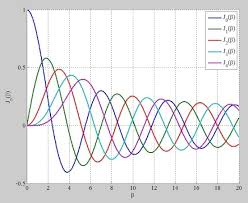
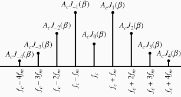

# Pound-Drever-Hall Laser Locking System

A hardware/software co-design implementation of a **[Pound-Drever-Hall](https://en.wikipedia.org/wiki/Pound%E2%80%93Drever%E2%80%93Hall_technique) (PDH) laser frequency locking system** on a Red Pitaya STEMlab 125-14 (Xilinx Zynq XC7Z010 SoC). Real-time signal processing runs on the FPGA (PL), a TCP control server runs on the ARM cores (PS), and a Python client API provides remote operation from a host machine. This document covers the basics of the system and its operation. More detailed architectural details can be found inside `DESIGN.md`. More detailed math (the optics math in particular is really cool) can be found inside `math_explainer.pdf` 

---

## Table of Contents

0.  [Why Would You Want This?]
1.  [How Does It Work?] 
1.  [Repository Structure](#repository-structure)
2.  [High-Level System Overview](#system-overview)
3.  [Client-side API and GUI]
4.  [Server Architecture]
5.  [Control Plane]
6.  [Data Plane]
7.  [PID Controller]
8.  [Numerically Controlled Oscillator (NCO)]
9.  [FIR Filter] 
10. [DMA Engine]
11. [Build and Deploy](#build-and-deploy)
12. [Hardware Specific Considerations]


---

## Repository Structure

```
core/
  hw/
    prj/pdh_core/
      rtl/               FPGA RTL (SystemVerilog)
        pdh_top.sv       Board-level wrapper: clocking, PS instantiation, HP0 AXI tie-offs
        pdh_core.sv      Main control module: command decoder, IQ rotation, IQ demod, DMA orchestrator
        nco.sv           Numerically controlled oscillator (dual-output, quarter-ROM)
        iq_demod.sv      Instantaneous-product demodulator (configurable ref × input, Q15)
        pid_core.sv      Discrete PID with EMA derivative, anti-windup, decimation
        bram_controller.sv  Dual-clock BRAM capture buffer (pdh_clk write / fclk0 read)
        dma_controller.sv   AXI4 master for HP0 DDR burst writes
        sine_qtr_rom.sv  4096-entry, 16-bit quarter-sine ROM
        posedge_detector.sv  Rising-edge detector utility
      tb/                Testbenches (SystemVerilog, Icarus)
  sim/                   All RTL simulations (cocotb)
    run_regression.py      Runner for the command-echo regression test
    run_bode.py            Open-loop Bode analysis simulation
    run_fir_freq.py        FIR frequency-response verification simulation
    utils/
      test_pdh_core.py     cocotb test module — command-echo checks for every RTL register
      test_bode.py         cocotb test module — open-loop Bode measurement
      test_fir_freq_response.py  cocotb test module — FIR frequency response vs ideal
    Makefile.cocotb        cocotb regression make rules
    Makefile.bode          Bode sim make rules
    Makefile.fir_freq      FIR freq-response make rules
    artifacts/             Auto-indexed simulation output (JSON, CSV, PNG)
  sw/
    server.c             TCP server: two-thread interrupt-driven architecture (command thread + callback thread)
    control/
      control.c          Command handler implementations (cmd_*_send / cmd_*_cb split functions)
      hw_common.c        Hardware abstraction: mmap of AXI GP0 and HP0 DMA region; UIO interrupt primitives
      inc/
        server.h         cmd_ctx_t, cmd_entry_t, output_item_t definitions
        hw_common.h      pdh_cmd_t, pdh_callback_t, dma_frame_t packed unions; all enums
        control.h        Command handler declarations
  dts/
    pdh_irq.dts          Device Tree overlay — binds /dev/uio/pdh_uio to IRQ_F2P[1] (GIC SPI 62)
client/
  gui.py                 Interactive tkinter GUI — full hardware control without scripting
  pdh_api/
    api.py               Python API functions wrapping each TCP command
    types.py             Enums and result dataclasses mirroring the C/RTL types
    fir_design.py        Windowed-sinc FIR lowpass design (shared by GUI and sim tooling)
  test.py                Board-level regression test and visualization script
sim/
  pdh.m                  MATLAB PDH signal simulation
  power_terms.m          MATLAB power series analysis
pcb/                     PCB design files
```


---

## Why Would You Want This

A ideal laser is a light source where the emmitted field is perfectly coherent. In other words, if you were to sample the field at any two points at one time or any two times at one point, there would be a deterministic phase relationship between those two points. However this doesn't actually happen in practice. This is because various noise sources can introduce photons out of phase with the main field, leading to part of the field's information being essentially random as it encodes the phase-trajectory relationship of all photons present, including the ones that were introduced randomly. At this point, the deterministic relationship breaks down and the beam is no longer coherent. The first-order effect of this is since frequency is the rate of phase change with respect to time, the laser's frequency and by extension wavelength now also contain a random component. Practically we can think of this as a light where the color always changes ever so slightly. In most everyday applications we probably wouldn't care, but in situations where the exact wavelength or phase needs to be maintained this becomes a problem. An example is in gravitational wave detection, where the phase difference between two laser beams is used to encode spatial distortion due to gravitational waves or in optical communication schemes employing Phase-Shift Keying (PSK) to encode symbols through the relative phase of the laser. An example where wavelength matters is in laser isotope separation where the wavelength needs to be locked to the absorbtion line of the target isotpoe. There are a bunch of other examples but they won't be covered here.

---

## How Does It Work

The main thing we can take advantage of is that if we keep the wavelength fixed, then by extension we keep the phase fixed. We also know that we can adjust the wavelength by adjusting the amount of power we supply to the laser. This means that if we can measure the total amount of phase error at any given point in time, then we can adjust the power we ourselves supply to the laser at that particular point in time in order to cancel it out. We measure the total amount of phase error at any given point in time by the difference in wavelength from our expected value. This difference encodes the overall phase contributions from all noise sources involved in the system. The main idea here is we don't know or care what those sources are, only that we can measure their affects and cancel them out. We do this by using a frequnecy discriminator, which is a special optical component (generally either a Fabry Perot Cavity or a Ring Resonator) that emits a signal whenever the wavelength of the beam deviates from the target. This is not good enough though because it doesn't tell us whether the wavelength is too wide or too narrow, so we don't know whether to give the laser more or less power. To deal with this we can modulate the beam with an Electro-Optic Modulator (EOM), which lets us take advantage of the [Jacobi-Anger Identity](https://math.stackexchange.com/questions/3839137/proving-the-jacobi-anger-expansion) to get a signal that can be decomposed into a series of sinusoids at frequencies centered around the resonance frequency, like in the figures below:

| J₁(β) | J₂(β) |
|:---:|:---:|
|  |  |


---

## System Overview

The general idea behind the system is anything that needs to be done fast and/or deterministically and/or interact with the physical world is done on the FPGA, anything that doesnt but still needs to interact with the FPGA is done on the hard processor (ARM Cortex A9), and everything else is done client-side. This also mirrors the level of care taken at each stage: virtually all RTL is hand-rolled (save for stylistic refactors), most of the server code was originally hand-written but it got too tedious after a while and so a lot of the new code is model-generated, and virtually all of the Python code was written by Claude (though the architecture was not). More granular implementation details are in the DESIGN.md doc, this doc will mainly focus on building up a useful mental model of the system so using it becomes intuitive. Application-wise, the system is similar to [Linien](https://github.com/linien-org/linien), albeit much less polished and much more hackable. Hackability in this context refers to giving the user direct control over as much of the RTL as possible — you can basically wire the inputs and outputs of any two modules inside the system up to each other in any way that you wish, which makes rapid ad-hoc lab tests on the fly easy. As such, the system is not only useful as a laser spectroscopy lock, but also as a lightweight oscilloscope, spectrum analyzer, PID controller, FIR filter, and function generator all in one. 

TLDR; it's a baby Moku.

---


## Client-Side API and GUI

An API is used to talk to the system from a laptop. A GUI is built on top of this API for better UX but it's not necesary and all interactions can be scripted for further reproducibility. The API uses a lightweight text-based protocol to communicate with the system. The contract structure is as follows:


### API Contract

#### Transmission
```
CMD:<cmd_name>
F:<float_arg_1>,<float_arg_2>,...
I:<int_arg_1>,<int_arg_2>,...
U:<uint_arg_1>,<uint_arg_2>,...
```

#### Reception
```
status:<status_field>
<callback_1>:<callback_1_from_system>
<callback_2>:<callback_2_from_system>
.
.
.
```


Transmission standardizes `command (CMD)`, `float (F)`, `int (I)`, and `uint (U)` fields. All commands require the `CMD` field to be specified. The existence of the others and the number of arguments supplied depends on the specific command being invoked. Reception fields are defined by the specific callback characteristics of the target command. The only field required is the `status` field. A `status` value of zero indicates that the command succeeded. Normally this means that the input arguments were legal and sensible and that the hardware was able to dispatch appropriately wherein the callback echoed back to the server matched what the server's dispatch logic for that command expected. A nonzero status field indicates some form of failure. Specific commands may have one or more conditions that trigger a nonzero failure mode (invalid args, hw not dispatching properly etc), the meaning of each nonzero code is specific to that command. An arbitrary number of additional callback fields can also be sent back during the response, the specifics of these fields depend on what command is being invoked.


### API implementation

A standardized execution model is provided which does 3 key things:
* 1. Provides a lock to ensure that only one API request may be made at a time
* 2. Unpacks the return string into a dict object as per the above contract details
* 3. Checks for a nonzero status field and raises an error if one is present (in some cases it may be useful to suppress this)


### GUI

The GUI is a tkinter app that works on top of the API to provide a more user-friendly interface to the system. When you run it you should see something like this: 

---

## Server Architecture
The server is basically just a loop that parses commands over the socket and dispatches the appropriate command to the fabric as needed, before returning a callback frame usually with data from the fabric back to the client. 

---


---

## Build and Deploy

Please note that the specific IP adress below is just a placeholder. To determine the IP for your system, locate the Red Pitaya MAC adress via sticker and find the IP mapping to that MAC. On Linux and Mac you can do this via `arp -a <your_mac_address_here>`

### RTL (FPGA Bitstream)

```bash
cd core/hw
make pdh_core       # Runs Vivado in batch mode; output: build/boot.bin
make clean
```

Requires Vivado and `bootgen` in PATH.

### Software (C Server)

```bash
cd core/sw
make server         # Cross-compiles for ARM; statically linked (-static -lm -lstdc++ -lpthread)
make clean
```

### Deploy (manual — raw SSH/SCP)

`deploy.sh` is not used. All deployment is done with plain `ssh`/`scp`.  Target: `root@10.42.0.62` (password: `root`).

#### 1. Flash the bitstream

```bash
# Copy bitstream to RP
scp core/hw/build/boot.bin root@10.42.0.62:/root/boot.bin

# Program the FPGA (full path required — fpgautil may not be in PATH over SSH)
ssh root@10.42.0.62 '/boot/bin/fpgautil -b /root/boot.bin -o /lib/firmware/base.dtbo'
```

#### 2. Build and copy the server

```bash
cd core/sw && make server
# Remove old build, copy fresh one
ssh root@10.42.0.62 'rm -rf /root/sw'
scp -r core/sw root@10.42.0.62:/root/sw
```

#### 3. Load the DTS overlay (PL-to-PS interrupt)

The interrupt path requires a Device Tree overlay that binds `/dev/uio/pdh_uio` to GIC SPI 62 (`IRQ_F2P[1]`).

```bash
# Compile the overlay on the host
dtc -I dts -O dtb -o core/dts/pdh_irq.dtbo core/dts/pdh_irq.dts

# Copy to RP
scp core/dts/pdh_irq.dtbo root@10.42.0.62:/root/pdh_irq.dtbo

# On the RP: remove any stale overlay, then load the new one
ssh root@10.42.0.62 '
    rmdir /sys/kernel/config/device-tree/overlays/pdh_irq 2>/dev/null || true
    mkdir -p /sys/kernel/config/device-tree/overlays/pdh_irq
    cp /root/pdh_irq.dtbo /sys/kernel/config/device-tree/overlays/pdh_irq/dtbo
'
```

After loading, verify the UIO device appears:

```bash
ssh root@10.42.0.62 'ls /dev/uio/pdh_uio'
```

#### 4. Start the server

**The server must be started from `sw/build/`** — `cmd_get_frame` writes `dma_log.csv` relative to the working directory.

```bash
ssh root@10.42.0.62 'cd /root/sw/build && ./server &'
```

#### 5. Start the GUI from your client
```Python
pyton gui.py
```

## Hardware Specifics

The system is currently meant to be run on a [STEMLab 125-14](https://redpitaya.com/stemlab-125-14/?srsltid=AfmBOopgVo9Tuy0RZu55bZxuKTTzMArpQeF5WWGbn-Z-MORJmZ4-cLcS) (both generations should work but it has been tested on Gen1).
