# Pound-Drever-Hall Laser Locking System

A hardware/software co-design implementation of a **[Pound-Drever-Hall](https://en.wikipedia.org/wiki/Pound%E2%80%93Drever%E2%80%93Hall_technique) (PDH) laser frequency locking system** on a Red Pitaya STEMlab 125-14 (Xilinx Zynq XC7Z010 SoC). Real-time signal processing runs on the FPGA (PL), a TCP control server runs on the ARM cores (PS), and a Python client API provides remote operation from a host machine. This document covers the basics of the system and its operation.

---

## Table of Contents

0.  [Repository Structure](#repository-structure)
1.  [Why Would You Want This?](#why-would-you-want-this?)
2.  [PDH Conceptual Overview](#pdh-conceptual-overview)
3.  [System Overview](#system-overview)
4.  [Protocol Timing](#protocol-timing)
5.  [PID Controller](#pid-controller)
6.  [FIR Filter](#fir-filter)
7.  [Build and Deploy](#build-and-deploy)
8.  [Hardware Specifics](#hardware-specifics)


---

## Repository Structure

```
core/
  hw/
    prj/pdh_core/
      rtl/               FPGA RTL (SystemVerilog)
        pdh_top.sv       Board-level wrapper: clocking, PS instantiation, HP0 AXI tie-offs
        pdh_core.sv      Main control module: command decoder, IQ rotation, IQ demod, DMA orchestrator
        nco.sv           Numerically controlled oscillator (dual-output, quarter-ROM)
        iq_demod.sv      Instantaneous-product demodulator (configurable ref × input, Q15)
        pid_core.sv      Discrete PID with EMA derivative, anti-windup, decimation
        bram_controller.sv  Dual-clock BRAM capture buffer (pdh_clk write / fclk0 read)
        dma_controller.sv   AXI4 master for HP0 DDR burst writes
        sine_qtr_rom.sv  4096-entry, 16-bit quarter-sine ROM
        posedge_detector.sv  Rising-edge detector utility
      tb/                Testbenches (SystemVerilog, Icarus)
  sim/                   All RTL simulations (cocotb)
    run_regression.py      Runner for the command-echo regression test
    run_bode.py            Open-loop Bode analysis simulation
    run_fir_freq.py        FIR frequency-response verification simulation
    utils/
      test_pdh_core.py     cocotb test module — command-echo checks for every RTL register
      test_bode.py         cocotb test module — open-loop Bode measurement
      test_fir_freq_response.py  cocotb test module — FIR frequency response vs ideal
    Makefile.cocotb        cocotb regression make rules
    Makefile.bode          Bode sim make rules
    Makefile.fir_freq      FIR freq-response make rules
    artifacts/             Auto-indexed simulation output (JSON, CSV, PNG)
  sw/
    server.c            
    control/
      control.c          Command handler implementations
      hw_common.c        Hardware abstraction: mmap of AXI GP0 and HP0 DMA region; UIO interrupt primitives
      inc/
        server.h         cmd_ctx_t, cmd_entry_t, output_item_t definitions
        hw_common.h      pdh_cmd_t, pdh_callback_t, dma_frame_t packed unions; all enums
        control.h        Command handler declarations
  dts/
    pdh_irq.dts          Device Tree overlay — binds /dev/uio/pdh_uio to IRQ_F2P[1] (GIC SPI 62)
client/
  gui.py                 Interactive tkinter GUI — full hardware control without scripting
  pdh_api/
    api.py               Python API functions wrapping each TCP command
    types.py             Enums and result dataclasses mirroring the C/RTL types
    fir_design.py        Windowed-sinc FIR lowpass design (shared by GUI and sim tooling)
  test.py                Board-level regression test and visualization script
sim/
  pdh.m                  MATLAB PDH signal simulation
  power_terms.m          MATLAB power series analysis
pcb/                     PCB design files
```


---

## Why Would You Want This?

An ideal laser is a light source where the emitted field is perfectly coherent. In other words, if you sample the field at any two points in space or any two points in time, there's a deterministic phase relationship between them. This doesn't actually happen in practice. Various noise sources can introduce photons that are out of phase with the main field, and once those mix in, the aggregate phase of the beam starts doing something partially random. At that point the deterministic relationship breaks down and the beam is no longer coherent. This is a problem when the exact phase or frequency of the laser needs to be maintained. One example is gravitational wave detection, where the phase difference between two laser beams encodes spatial distortion from a passing wave. Another is optical communication using Phase-Shift Keying (PSK), where information is encoded in the relative phase of the carrier. And since frequency is just the first derivative of phase and wavelength follows from frequency, random phase noise also translates to wavelength jitter — which matters in applications like laser isotope separation, where the wavelength needs to sit on the absorption line of a specific isotope. There are a bunch of other examples but they won't be covered here.

| Good Laser | Bad Laser |
|:---:|:---:|
| 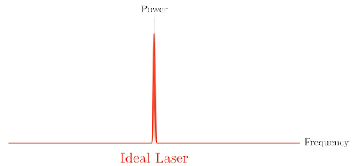 | 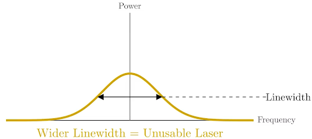 |


#### TLDR; Really clean lasers can be useful.

---

## PDH Conceptual Overview

The main thing we can take advantage of is that if we keep the wavelength fixed, then by extension we can keep the phase fixed. We also know that we can adjust the wavelength by adjusting the amount of power we supply to the laser. We do this by using a frequency discriminator, which is a special optical component (generally either a Fabry Perot Cavity or a Ring Resonator) that emits a signal whenever the wavelength of the beam deviates from the resonance point. This is not good enough though because it doesn't tell us whether the wavelength is too wide or too narrow. To handle this, we use an Electro-Optic Modulator (EOM) to apply a periodic phase shift to the input beam. We then take the output beam and pass it to a photodiode to convert it to an electrical signal before multiplying it by the same sinusoidal signal driving our EOM. At this point, the multiplication product will reflect both the magnitude AND direction of our deviation from the resonance wavelength:

| Time Domain Representation | Frequency Domain Representation |
|:---:|:---:|
| 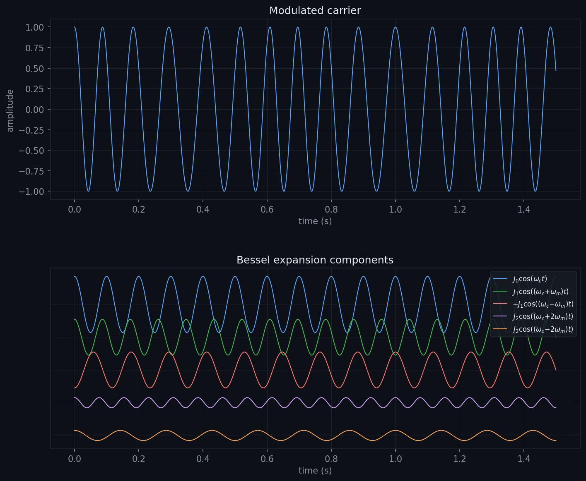 | 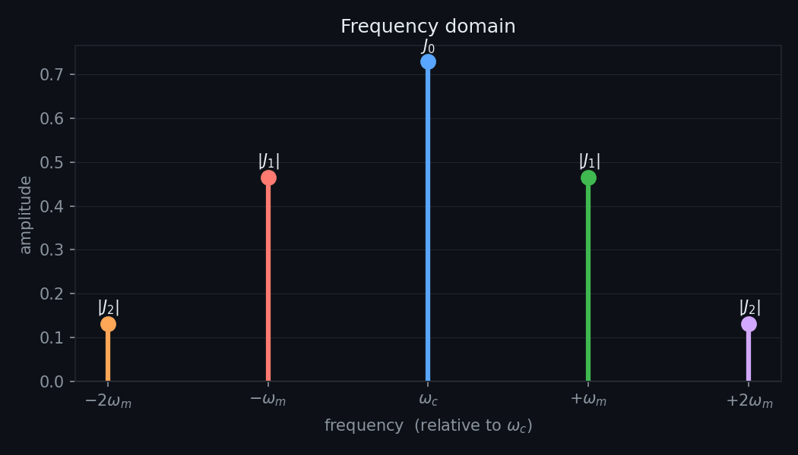 |

Above are time-domain and frequency domain representations of our modulated signal, which we can break into a series of superimposing sinusoids. The red and green tones are our sidebands, and we use them to encode the frequency offset information.


#### TLDR; Beam->EOM->Cavity->Photodiode->Demodulator
#### Alternative TLDR; We use the sidebands to encode our error signal, then demodulate them to extract it. From there we can generate a control signal to correct our laser.


---
## System Overview


The general idea behind the system is anything that needs to be done fast and/or deterministically and/or interact with the physical world is done on the FPGA, anything that doesnt but still needs to interact with the FPGA is done on the hard processor (ARM Cortex A9), and everything else is done client-side. The system is similar to [Linien](https://github.com/linien-org/linien), albeit much less polished and much more hackable. Hackability in this context refers to giving the user direct control over as much of the RTL as possible — you can basically wire the inputs and outputs of any two modules inside the system up to each other in any way that you wish, which makes rapid ad-hoc lab tests on the fly easy. As such, the system is not only useful as a laser spectroscopy lock, but also as a lightweight oscilloscope, spectrum analyzer, PID controller, FIR filter, and function generator all in one. 


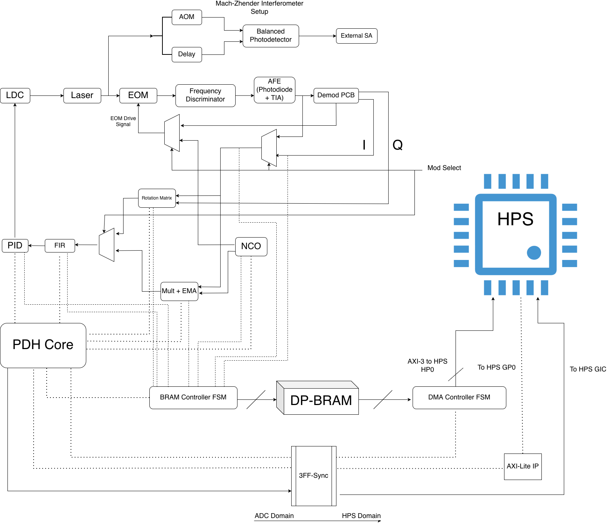

In the diagram above, dotted lines indicate control/callback signals routed to/from submodules by the PDH core. Dashed lines indicate data taps that can be selected to feed the DMA engine. 


TLDR; it's a baby Moku.


---
## Protocol Timing

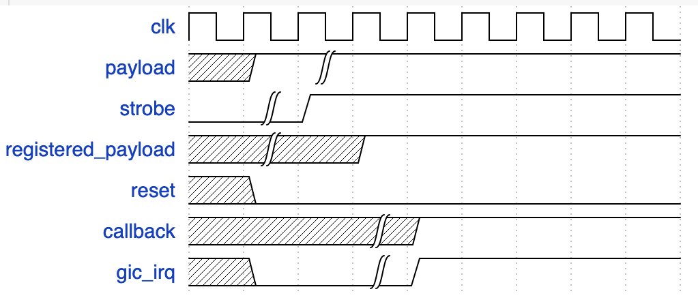

The command word is 32 bits: [31]=reset, [30]=strobe, [29:26]=command code, [25:0]=payload. Every transaction consists of the PS writing the word twice — strobe low, then strobe high. The FPGA passes the raw GPIO input through a 3-stage flip-flop synchronizer before decoding it, which handles the clock domain crossing between the PS AXI bus and the 125 MHz fabric clock. A posedge detector on the synchronized strobe fires when that edge comes through, latching the command word and executing it on that same clock cycle. The callback register is combinatorial off the current state, so it's valid at that same point. A 1-cycle GIC interrupt fires coincident with the strobe edge detection — the C server is blocked on a `read()` of `/dev/uio/pdh_uio`, which unblocks when the interrupt fires, and then the callback register gets sampled.

`CMD_GET_FRAME` is different — no interrupt fires on the strobe. The DMA state machine runs through its sequence (BRAM fill at the decimated rate, then an AXI4 burst to DDR over HP0), and the interrupt fires when the transfer is done. The server side waits on `select()` with a timeout computed from the decimation depth rather than blocking indefinitely.

`CMD_IDLE` generates no interrupt at all. It just resets the DMA state machine back to armed so the next `CMD_GET_FRAME` starts clean.

The reset bit is completely separate from the strobe path and goes straight to the synchronous reset chain regardless of anything else in the word.

#### TLDR; PS writes command word twice (strobe 0→1), FPGA latches on the synchronized rising edge, callback is valid on that same clock cycle, interrupt tells the PS it's ready.


---
## PID Controller

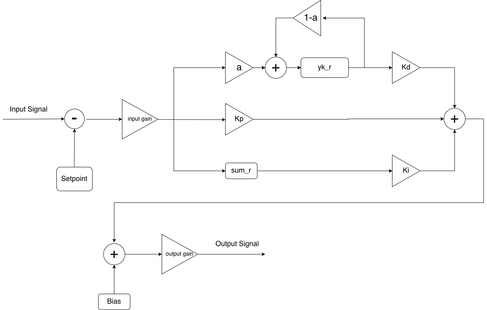

The block diagram shows the structure. The input signal has the setpoint subtracted, passes through the input gain stage (`egain`), and then splits into three paths — Kp directly, Kd via the EMA block, and Ki through the running integrator (`sum_r`). The three products are summed and then scaled by the output gain before the bias is added.

The derivative path is worth explaining since it's not a standard differentiator. The core keeps a running exponential moving average of the error (`yk_r` in the diagram). The alpha and (1-alpha) scaling blocks feed into that register's update loop, and Kd multiplies the difference between the current error and `yk_r`. That difference is the deviation of the error from its recent mean, which is a reasonable approximation of the derivative without being as noise-sensitive as a true differentiator. The alpha parameter sets the EMA time constant.

The integrator has saturation at ±2^`satwidth` and freezes in whichever direction would push it further when the output is already railed — standard anti-windup. Without it the integrator winds up to full scale any time the system is outside the lock pull-in range and then takes forever to recover once it gets back in.

The output is 14-bit unsigned offset-binary (DAC code), with 0 V mapped to code 8191. The decimation parameter slows the PID update rate independently of everything else — the NCO, ADC, and DMA all still run at full rate, the PID output just holds between updates.

#### TLDR; Standard PID with EMA derivative and integrator anti-windup. Kp/Ki/Kd are Q15 fractions, input and output gain stages let you scale without touching the individual terms.


---
## FIR Filter

The two spectra below are frequency-domain captures of a cavity sweep.

| Original Signal | Sampling at Decimated Rate |
|:---:|:---:|
| 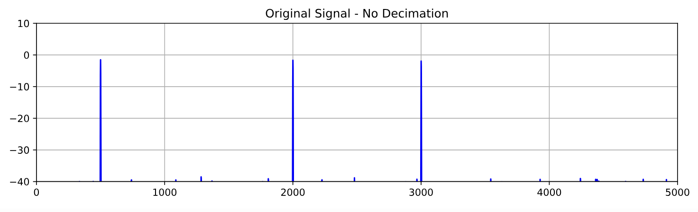 | 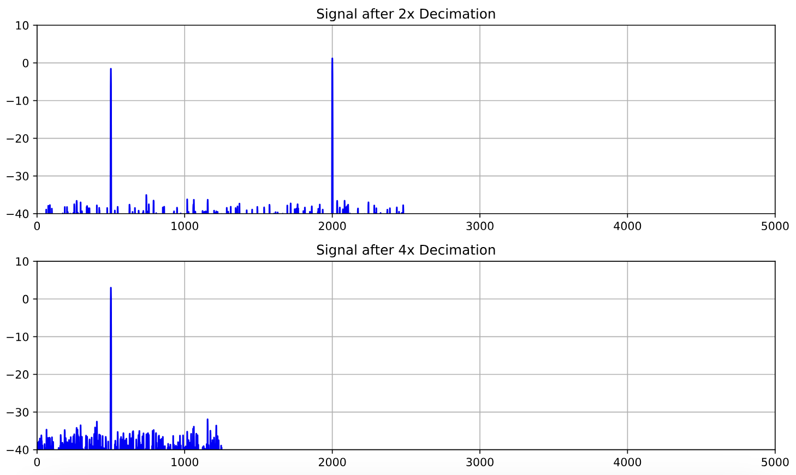 |

At full rate the resonance tones sit cleanly on a noise floor around -40 dB. At 2x and 4x decimation without any anti-aliasing, the upper half of the spectrum folds back in around the new Nyquist and the noise floor comes up significantly. The FIR is what prevents that — it knocks out everything above the decimated Nyquist before the downsampling happens.

The structure is a 32-tap direct-form filter with a registered saturating adder tree reducing all the tap outputs down to one. The diagram below shows it: the input clocks through a shift register along the top, each stage multiplies by its stored coefficient, the products register, and then get summed pairwise down to the output. Saturation is applied at every add level so there's no way for overflow to propagate up the tree. 32 taps means 5 levels of pairwise adds plus the one tap-level register, so 6 cycles of total pipeline latency.

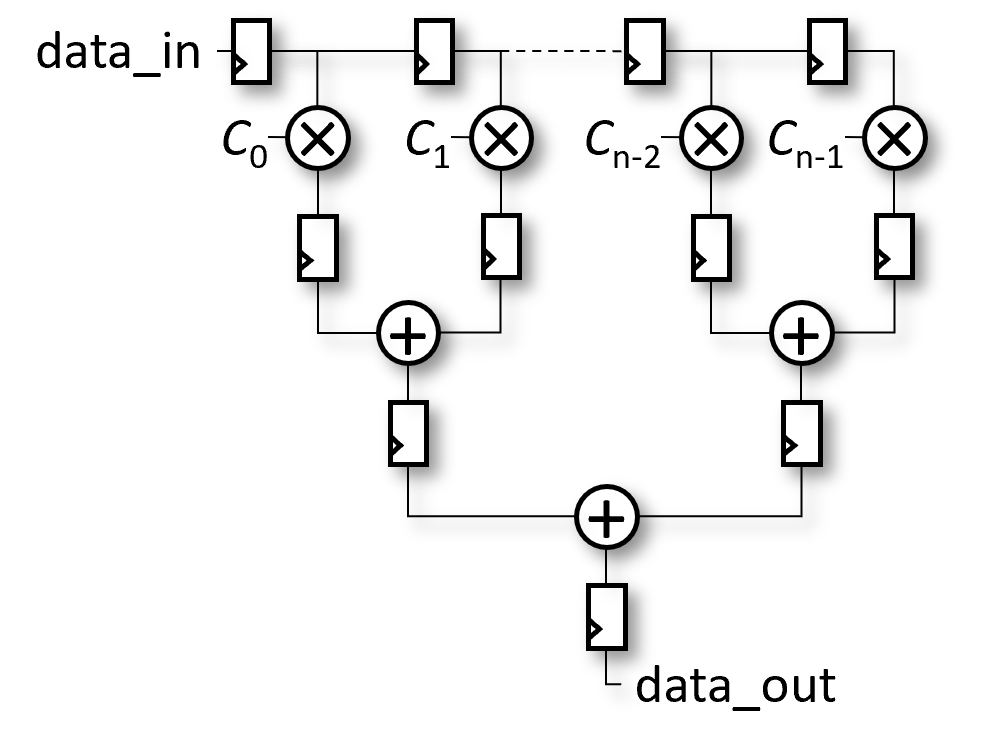

The coefficients are a windowed sinc — the ideal lowpass impulse response truncated to 32 samples and multiplied by a window. The diagram below shows how that relates to the input samples: at each output time the stored coefficients are just the windowed sinc evaluated at the sample offsets around that point.

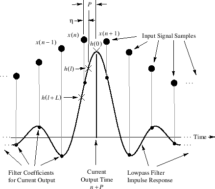

Coefficients are loaded by writing them one at a time into a staging memory, then atomically committing the whole set to the active tap registers in one shot. This means the filter never runs with a partially-updated coefficient set during a live load.

| FIR Ideal vs RTL Freq Resp | H(w) Comparison With Different Windowing Schemes|
|:---:|:---:|
| 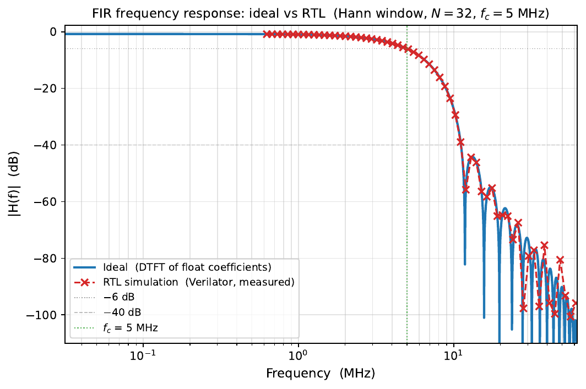 | 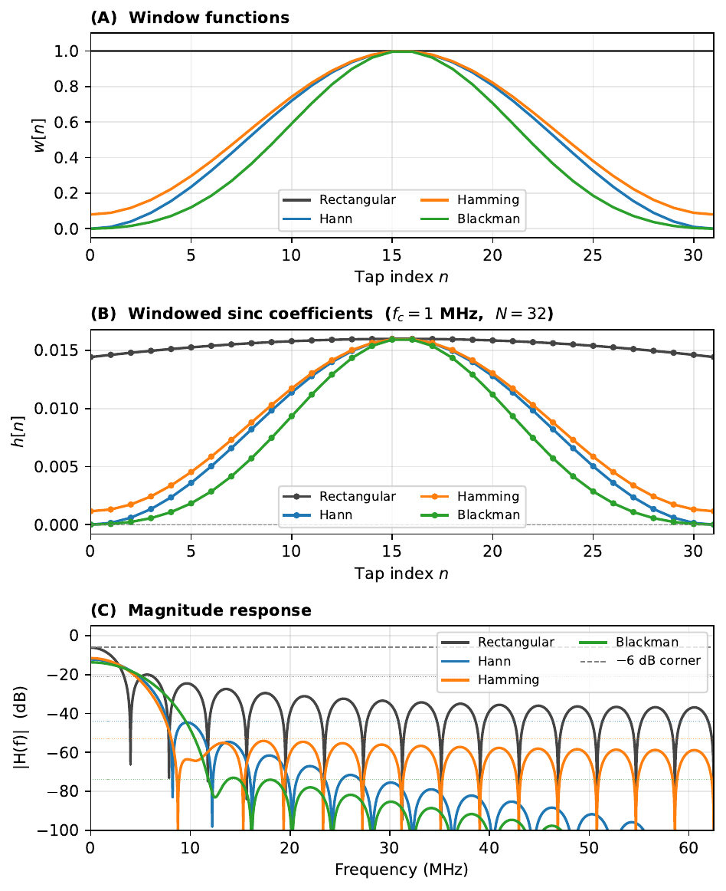 |

The frequency response plot on the left is for a Hann-windowed design at fc=5 MHz with N=32. The RTL simulation (measured in Verilator) tracks the ideal floating-point response closely down to about -80 dB, which is roughly where Q15 quantization noise lifts the stopband floor. The right figure shows the tradeoff between windowing schemes — rectangular has the sharpest transition band but terrible sidelobe rejection (the first stopband lobe barely makes it to -20 dB), while Blackman gets to -75 dB or better at the cost of a wider transition. For a PDH lock where the EOM modulation frequency is well separated from the cavity linewidth, Blackman or Hann is the right call.

The capture below is from hardware — fir_in is the raw wideband signal going into the filter, fir_out is the 100 kHz lowpass output.

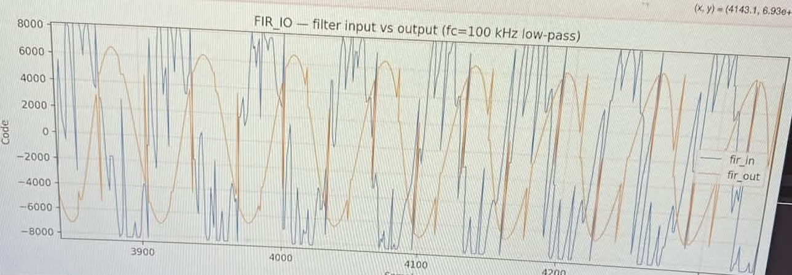

## Build and Deploy

Please note that the specific IP adress below is just a placeholder. To determine the IP for your system, locate the Red Pitaya MAC adress via sticker and find the IP mapping to that MAC. On Linux and Mac you can do this via `arp -a <your_mac_address_here>`

### RTL (FPGA Bitstream)

```bash
cd core/hw
make pdh_core       # Runs Vivado in batch mode; output: build/boot.bin
make clean
```

Requires Vivado and `bootgen` in PATH.

### Software (C Server)

```bash
cd core/sw
make server         # Cross-compiles for ARM; statically linked (-static -lm -lstdc++ -lpthread)
make clean
```

### Deploy (manual — raw SSH/SCP)

`deploy.sh` is not used. All deployment is done with plain `ssh`/`scp`.  Target: `root@10.42.0.62` (password: `root`).

#### 1. Flash the bitstream

```bash
# Copy bitstream to RP
scp core/hw/build/boot.bin root@10.42.0.62:/root/boot.bin

# Program the FPGA (full path required — fpgautil may not be in PATH over SSH)
ssh root@10.42.0.62 '/boot/bin/fpgautil -b /root/boot.bin -o /lib/firmware/base.dtbo'
```

#### 2. Build and copy the server

```bash
cd core/sw && make server
# Remove old build, copy fresh one
ssh root@10.42.0.62 'rm -rf /root/sw'
scp -r core/sw root@10.42.0.62:/root/sw
```

#### 3. Load the DTS overlay (PL-to-PS interrupt)

The interrupt path requires a Device Tree overlay that binds `/dev/uio/pdh_uio` to GIC SPI 62 (`IRQ_F2P[1]`).

```bash
# Compile the overlay on the host
dtc -I dts -O dtb -o core/dts/pdh_irq.dtbo core/dts/pdh_irq.dts

# Copy to RP
scp core/dts/pdh_irq.dtbo root@10.42.0.62:/root/pdh_irq.dtbo

# On the RP: remove any stale overlay, then load the new one
ssh root@10.42.0.62 '
    rmdir /sys/kernel/config/device-tree/overlays/pdh_irq 2>/dev/null || true
    mkdir -p /sys/kernel/config/device-tree/overlays/pdh_irq
    cp /root/pdh_irq.dtbo /sys/kernel/config/device-tree/overlays/pdh_irq/dtbo
'
```

After loading, verify the UIO device appears:

```bash
ssh root@10.42.0.62 'ls /dev/uio/pdh_uio'
```

#### 4. Start the server

**The server must be started from `sw/build/`** — `cmd_get_frame` writes `dma_log.csv` relative to the working directory.

```bash
ssh root@10.42.0.62 'cd /root/sw/build && ./server &'
```

#### 5. Start the GUI from your client
```Python
python gui.py
```

At this point, you should see something similar to the below:

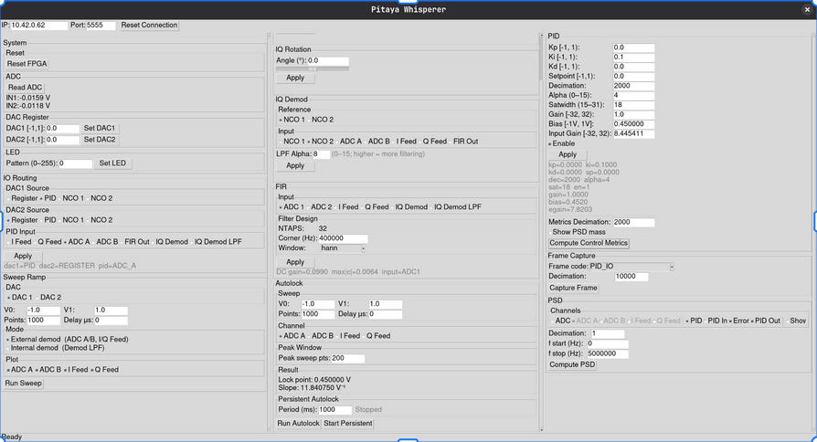


## Hardware Specifics

The system is currently meant to be run on a [STEMLab 125-14](https://redpitaya.com/stemlab-125-14/?srsltid=AfmBOopgVo9Tuy0RZu55bZxuKTTzMArpQeF5WWGbn-Z-MORJmZ4-cLcS) (both generations should work but it has been tested on Gen1). If porting to another system, ensure that the ADC and DAC coding schemes are adjusted accordingly. 

The AD9767 only has one input port connected on the r125-14. Therefore the system configures it to run in interleaved mode coherent with the timing diagram below.

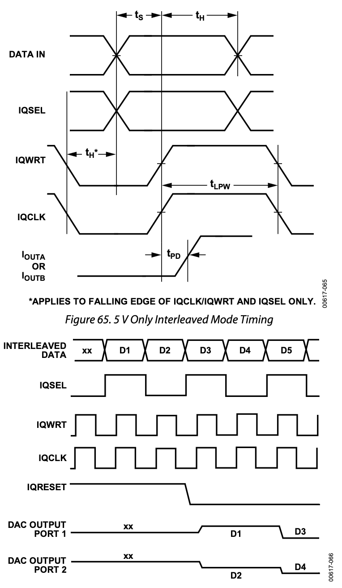
